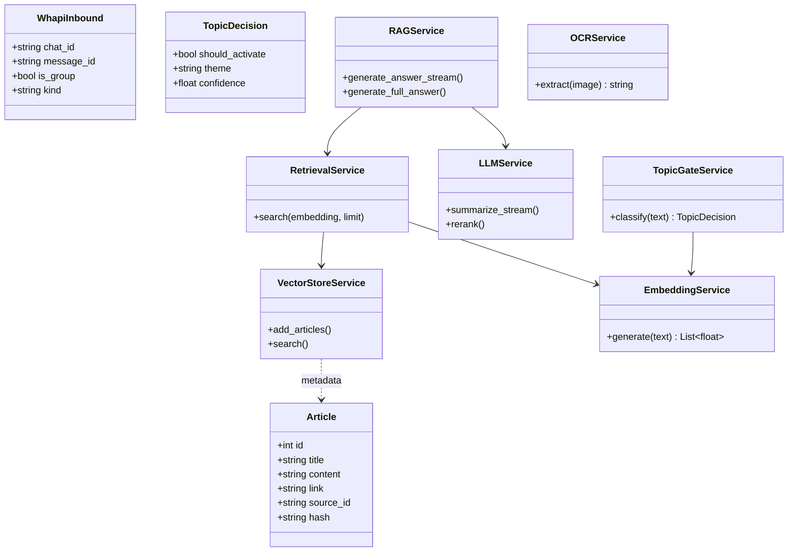
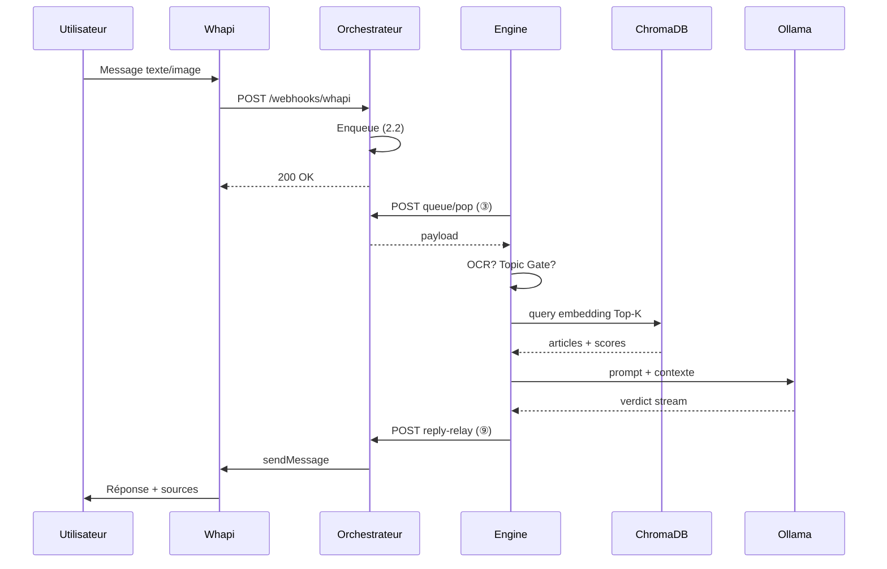
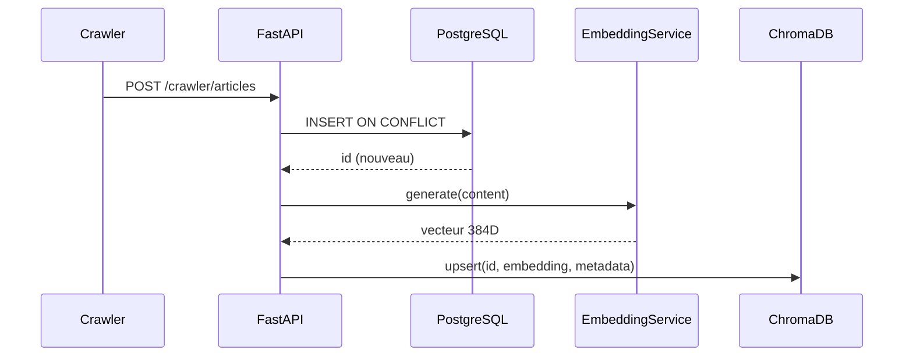

# Chapitre 3 — Modélisation de l’application RDC News Intelligence

| Attribut | Valeur |
|----------|--------|
| **Document** | Chapitre_3_Modelisation |
| **Projet** | RDC News Intelligence |
| **Version** | 1.0 |
| **Prérequis** | Chapitre 2 — architecture et flux ([`README_CHAPITRE_2.md`](README_CHAPITRE_2.md)) |
| **Diagrammes** | [`tdraw/`](tdraw/) · [`architecture-memoire-duale-rdc-news.png`](architecture-memoire-duale-rdc-news.png) |

---

## 1. Introduction

### 1.1 Objet du chapitre

Le chapitre 2 a présenté l’**architecture** du système (Orchestrateur, Engine, mémoire duale PostgreSQL/ChromaDB, pipeline crawler). Le présent chapitre formalise la **modélisation UML** de l’application : acteurs, cas d’utilisation, structure des classes principales, modèle de données et scénarios dynamiques.

Il ne redéfinit pas les concepts RAG, embeddings ou anti-surinformation ; il les **instancie** dans des vues de conception réutilisables pour le mémoire et la soutenance.

### 1.2 Périmètre

**Inclus :** vues statique et dynamique du backend `ai-service`, interfaces messagerie (Whapi, Telegram), corpus et administration.

**Hors périmètre :** détail du frontend Next.js, déploiement physique (chapitre 4), tests de charge exhaustifs.

---

## 2. Acteurs du système

| Acteur | Description | Interaction |
|--------|-------------|-------------|
| **Utilisateur** | Citoyen ou membre d’un groupe WhatsApp/Telegram | Envoie texte ou image à vérifier |
| **Passerelle messagerie** | Whapi.Cloud, API Telegram | Webhooks entrants, envoi des réponses |
| **Opérateur / administrateur** | Mainteneur du service | Consulte statistiques, lance crawl/sync |
| **Médias sources** | Sites d’actualité RDC | Fournissent les articles via le crawler (acteur externe) |
| **Système RDC News** | Application `ai-service` | Orchestrateur + Engine sur un serveur |

---

## 3. Cas d’utilisation

### 3.1 Diagramme de contexte (synthèse)

```
                    ┌─────────────────────┐
                    │  Système RDC News   │
                    │  (ai-service)       │
    Utilisateur ───►│                     │◄─── Médias (crawler)
    Passerelle  ───►│  UC1 Vérifier       │
    Admin       ───►│  UC2 Alimenter      │
                    │  UC3 Administrer   │
                    └─────────────────────┘
```

### 3.2 Liste des cas d’utilisation

| ID | Cas d’utilisation | Acteur principal | Description |
|----|-------------------|------------------|-------------|
| **UC1** | Vérifier une information | Utilisateur | Soumettre une rumeur (texte/image) ; recevoir verdict (VRAI, FAUX, IMPRÉCIS, NON VÉRIFIABLE) et sources |
| **UC2** | Alimenter le corpus | Système (crawler) / Admin | Collecter, indexer et synchroniser les articles vers PostgreSQL et ChromaDB |
| **UC3** | Consulter l’état du corpus | Administrateur | Obtenir volumétrie, sources, alignement Postgres/Chroma |
| **UC4** | Interroger via le canal web | Utilisateur web | `POST /rag` sans passer par la file Whapi (optionnel) |
| **UC5** | Filtrer le bruit en groupe | Système | Topic Gate : ignorer les messages hors actualité RDC (groupes WhatsApp/Telegram) |

### 3.3 Préconditions et postconditions (UC1 — cœur métier)

| | Contenu |
|---|---------|
| **Préconditions** | Corpus indexé ; service et Ollama disponibles ; webhook ou polling actif |
| **Déclencheur** | Message entrant sur WhatsApp ou Telegram |
| **Scénario nominal** | Réception → file (Orchestrateur) → traitement (Engine) → RAG → verdict → envoi |
| **Postconditions** | Utilisateur reçoit une réponse sourcée ; optionnel : mémorisation courte pour anti-doublon |
| **Extensions** | OCR si image ; NON VÉRIFIABLE si corpus insuffisant ; message ignoré si Topic Gate (groupe) |

### 3.4 Différenciation groupe / privé (WhatsApp)

| Contexte | Topic Gate | Comportement attendu |
|----------|------------|----------------------|
| **Groupe** (`@g.us`) | Activé | Seuls les messages liés à l’actualité RDC (politique, sport, santé, guerre) déclenchent le RAG |
| **Privé (1:1)** | Désactivé | Réponse plus large : la question est traitée sans filtre thématique préalable |

*Telegram : le Topic Gate peut s’appliquer aussi en privé dans le pipeline actuel — voir chapitre 4 pour l’évolution possible.*

---

## 4. Vue des classes (modèle statique simplifié)

La conception repose sur des **services** FastAPI plutôt que sur un modèle objet lourd. Le diagramme suivant regroupe les entités et services **métier** pertinents pour le mémoire.

### 4.1 Diagramme de classes (niveau conception)



### 4.2 Responsabilités par classe / service

| Composant | Responsabilité |
|-----------|----------------|
| `Article` / `ArticleOut` | Données article (schéma Pydantic + table SQL) |
| `WhapiInbound` | Normalisation d’un message Whapi entrant |
| `EmbeddingService` | Vectorisation (384 dim., modèle multilingue) |
| `VectorStoreService` | Persistance et requête ChromaDB |
| `RetrievalService` | Recherche Top-K par similarité cosinus |
| `RAGService` | Orchestration retrieval → filtre → LLM |
| `LLMService` | Appels Ollama/Mistral (génération, rerank) |
| `TopicGateService` | Filtrage thématique groupes |
| `OCRService` | Extraction texte depuis image |
| `MemoryService` | Cache court terme anti-répétition (conversation) |

### 4.3 Blocs Orchestrateur et Engine (vue paquetage)

| Paquetage | Classes / modules principaux |
|-----------|------------------------------|
| **Orchestrateur** | Routes `webhooks` (entrée Whapi/Telegram), file FIFO, `reply-relay`, envoi Whapi |
| **Engine** | `RAGService`, `TopicGateService`, `OCRService`, crawler ingest, `train_pipeline` |
| **Données** | PostgreSQL (`articles`, `training_runs`), Chroma (`articles_rdc`) |

---

## 5. Modèle de données

### 5.1 Vue entité-relation (PostgreSQL)

```
┌─────────────────┐       ┌──────────────────┐
│    articles     │       │  training_runs   │
├─────────────────┤       ├──────────────────┤
│ id (PK)         │       │ id (PK)          │
│ title           │       │ started_at       │
│ content         │       │ ended_at         │
│ link (UNIQUE)   │       │ status           │
│ hash (UNIQUE)   │       │ model_name       │
│ source_id       │       │ processed_count  │
│ categories[]    │       │ note             │
│ image           │       └──────────────────┘
│ created_at      │
│ embedding[]*    │  * optionnel (pgvector), non chemin nominal
└────────┬────────┘
         │ id (1:1)
         ▼
┌─────────────────┐
│ ChromaDB        │
│ articles_rdc    │
│ id, embedding │
│ document, meta  │
└─────────────────┘
```

### 5.2 Correspondance identifiant Postgres ↔ Chroma

| Champ | PostgreSQL | ChromaDB |
|-------|------------|----------|
| Clé | `articles.id` (SERIAL) | `ids = str(id)` |
| Texte | `content` | `documents` |
| Métadonnées | colonnes relationnelles | `metadatas` (title, link, source_id, hash, …) |

### 5.3 Entités cibles (évolution documentée)

Pour la modélisation complète anti-surinformation et audit, le schéma cible prévoit (non obligatoire à la soumission) :

| Entité cible | Rôle |
|--------------|------|
| `conversations` / `chat_id` | Regroupement par groupe ou privé |
| `inbound_messages` | Message reçu, horodatage |
| `verifications` | Verdict, scores, lien vers articles cités |

---

## 6. Diagrammes de séquence

### 6.1 UC1 — Vérification d’un message WhatsApp (Whapi, serveur unique)



### 6.2 UC2 — Ingestion d’un article (crawler)



### 6.3 UC5 — Topic Gate (groupe)

1. Message groupe reçu par l’Engine.  
2. `TopicGateService.classify` : mots-clés statiques + dynamiques (titres récents Postgres) + classification LLM.  
3. Si `confidence < 0,6` → fin (pas de RAG).  
4. Sinon → enchaînement UC1 à partir du retrieval.

---

## 7. Interfaces externes (résumé)

| Interface | Protocole | Producteur / consommateur |
|-----------|-----------|---------------------------|
| Webhook Whapi | HTTPS POST | Passerelle → Orchestrateur |
| `queue/pop`, `reply-relay` | HTTPS POST interne | Engine ↔ Orchestrateur |
| API Telegram | HTTPS | Bot API ↔ Engine |
| Ollama | HTTP local | Engine → LLM |
| PostgreSQL | SQL | Engine, admin |
| ChromaDB | API Python locale | Engine |

Le détail des routes est en chapitre 2 (§9) ; le déploiement des endpoints publics en chapitre 4.

---

## 8. Traçabilité conception ↔ chapitre 2

| Élément chapitre 3 | Référence chapitre 2 |
|--------------------|----------------------|
| Orchestrateur / Engine | §4.4, §5 |
| Modules M1–M9 | §7 |
| Mémoire duale | §8.2 |
| Anti-surinformation | §6.4.5, §10 |
| Crawler | §8.4 |

---

## 9. Conclusion du chapitre

Ce chapitre a fourni une **modélisation UML allégée** de RDC News Intelligence : cinq cas d’utilisation centrés sur la vérification et l’alimentation du corpus, une vue de classes par services, un modèle de données Postgres/Chroma aligné sur l’implémentation, et deux diagrammes de séquence pour les flux critiques (message utilisateur et ingestion).

Le chapitre 4 décrit comment cette conception est **déployée** sur un serveur unique (VPS), avec la stack technique et les procédures de migration des bases.

---

## 10. Figures recommandées pour le document Word

| Figure | Fichier suggéré |
|--------|-----------------|
| Architecture globale | `architecture-memoire-duale-rdc-news.png` |
| Modules messagerie → RAG | `tdraw/00-vue-generale.tldr` |
| Corpus Chroma | `tdraw/05-module-corpus-chroma.tldr` |
| Modèle de données | `architecture-bases-donnees-rdc-news.png` |

---

*Fin du Chapitre 3 — Modélisation.*
