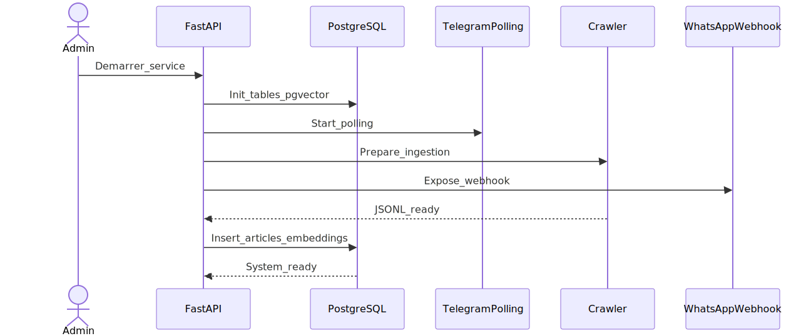
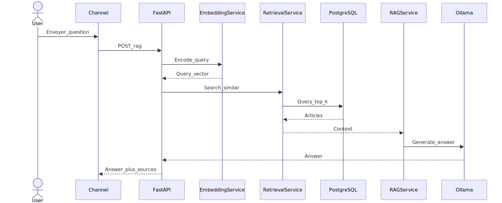

# Chapitre 3 : Modélisation et architecture du système RAG et intégration multicanale

## 3.1. Introduction

Le projet RDC News Intelligence repose sur une architecture orientée services dont l'objectif est de transformer un corpus d'actualité en base de connaissance exploitable à la demande. Contrairement à une approche centrée sur le classement statique des sujets, le système proposé combine la recherche sémantique, la récupération ciblée de documents et la génération de réponses contextualisées. Cette combinaison correspond au paradigme Retrieval-Augmented Generation, ou RAG, qui permet d'ancrer la réponse produite par le modèle de langage dans des sources réelles et actualisées.

L'intérêt d'une telle architecture est particulièrement fort dans un contexte comme celui de la RDC, où les sources sont nombreuses, les contenus redondants et les usages fortement mobiles. Le système doit donc être capable de répondre rapidement, de fonctionner sur des canaux familiers et d'intégrer des données nouvelles sans redéploiement lourd. Le présent chapitre décrit la modélisation du système, ses composants principaux, les cas d'utilisation retenus, le modèle de données et les choix architecturaux qui justifient sa structure.

## 3.2. Spécifications fonctionnelles et non fonctionnelles

### 3.2.1. Spécifications fonctionnelles

Le système doit répondre à plusieurs besoins fonctionnels. Il doit d'abord permettre à un utilisateur de soumettre une requête textuelle et d'obtenir en retour une synthèse structurée fondée sur les articles les plus pertinents. Il doit également accepter une image contenant du texte, extraire le contenu par OCR, puis utiliser ce texte comme base de recherche dans le moteur RAG. En parallèle, il doit exposer ses fonctionnalités via plusieurs interfaces, notamment une interface web, Telegram et WhatsApp. Dans les conversations privées, le système répond à toutes les requêtes; dans les groupes, il n'active le traitement qu'après une évaluation thématique portant sur la politique, le sport, la santé ou la guerre.

Le système doit aussi permettre l'ingestion continue de nouvelles sources. Cette fonction est assurée par le crawler, qui enrichit régulièrement le corpus. Enfin, il doit conserver les articles, leurs métadonnées et leurs embeddings dans une base de données permettant une recherche rapide et cohérente.

### 3.2.2. Spécifications non fonctionnelles

Sur le plan non fonctionnel, plusieurs contraintes ont été retenues. La première est la réactivité. Le système doit fournir des réponses suffisamment rapides pour être utilisable dans un contexte conversationnel. La seconde est la confidentialité, car une partie du traitement est effectuée localement, notamment l'OCR et la génération de texte. La troisième est la robustesse: le système doit tolérer l'ajout de nouvelles sources, de nouveaux articles et, si nécessaire, un changement de modèle d'embedding. La quatrième est la maintenabilité, ce qui suppose une séparation claire entre la collecte, l'indexation, la recherche et la génération.

## 3.3. Cas d'utilisation

### 3.3.1. Requête textuelle via messagerie

Le premier cas d'utilisation concerne l'utilisateur qui interroge le système par message texte. L'utilisateur formule une question, par exemple sur un événement politique, sanitaire ou médiatique. Le message est capté par le canal de communication, puis transmis au backend. Dans un groupe, ce message est d'abord évalué par un filtre thématique IA afin de vérifier qu'il concerne bien la politique, le sport, la santé ou la guerre. Si le message est accepté, le texte est vectorisé, comparé aux articles indexés dans PostgreSQL, et les documents les plus proches sont utilisés comme contexte pour la génération d'une réponse.

Le résultat attendu n'est pas une réponse générale produite hors contexte, mais une synthèse structurée accompagnée de références. Cette logique permet de transformer une simple requête en une réponse utile, vérifiable et contextualisée.

### 3.3.2. Requête par image

Le second cas d'utilisation concerne l'analyse d'une image contenant du texte. Dans ce scénario, l'utilisateur envoie une capture d'écran, une affiche ou un visuel partagé sur une messagerie. Le système récupère l'image, extrait le texte par OCR, puis applique le même pipeline que pour une requête textuelle. Lorsque l'image est accompagnée d'une légende, le texte de la légende est combiné au résultat OCR avant l'évaluation thématique, ce qui permet de décider si le message mérite une activation du bot en groupe.

Cette fonctionnalité est importante dans un environnement où les rumeurs circulent souvent sous forme d'images partagées dans les groupes WhatsApp. Elle permet d'utiliser le moteur RAG non seulement comme outil de recommandation, mais aussi comme aide à la vérification rapide.

### 3.3.3. Mise à jour du corpus

Le troisième cas d'utilisation est celui de l'alimentation continue du corpus. Un administrateur ou un processus planifié déclenche le crawler, qui collecte les nouveaux contenus publiés sur les sources configurées. Les articles sont ensuite injectés dans le système, nettoyés, vectorisés et stockés avec leurs métadonnées. Ce processus assure que le corpus reste vivant et adapté à l'actualité.

## 3.4. Modélisation des données

Le modèle de données est centré sur l'article. Chaque article est caractérisé par son titre, son corps, son URL, sa source, sa date de publication et son embedding. L'embedding constitue l'élément clé du système, car il permet la recherche sémantique. Les sources sont décrites séparément afin de faciliter la gestion des flux et l'ajout de nouvelles origines de données.

La base de données peut également conserver des informations de traçabilité sur les opérations de ré-embedding ou de mise à jour du corpus. Cette décision est utile pour suivre l'évolution du système et pour documenter les changements de modèle ou d'index.

L'usage de PostgreSQL avec pgvector répond à un besoin de simplicité et de cohérence. La base devient à la fois un stockage documentaire et un moteur de recherche vectoriel. Cette approche réduit les dépendances externes et favorise une architecture plus facile à déployer localement.

## 3.5. Architecture logicielle

### 3.5.1. Vue d'ensemble

L'application est organisée autour d'un noyau FastAPI qui orchestre l'ensemble des flux. Ce noyau expose les routes de requêtes, les webhooks de messagerie et les endpoints d'ingestion. Autour de lui, plusieurs services spécialisés prennent en charge chaque brique fonctionnelle: la vectorisation, la recherche, la génération, l'OCR et la gestion des articles.

Cette séparation des responsabilités permet de conserver une structure claire. Chaque service remplit un rôle précis et peut évoluer indépendamment. L'architecture obtenue est ainsi plus lisible, plus maintenable et plus simple à tester.

### 3.5.2. Chaîne de traitement RAG

Lorsqu'une requête arrive, le système suit une chaîne de traitement stable. Le texte est d'abord encodé sous forme vectorielle. Le vecteur est ensuite comparé aux embeddings enregistrés dans la base. Les articles les plus proches sont extraits, puis fournis au service de génération. Ce dernier construit une réponse à partir du contexte récupéré et renvoie un texte structuré vers le canal d'origine.

Cette chaîne constitue le cœur du projet. Elle garantit que la réponse finale ne dépend pas uniquement de la capacité générative du modèle, mais aussi de la qualité du corpus et de la pertinence de la récupération.

### 3.5.3. Intégration multicanale

L'accès au système est prévu sur plusieurs canaux. Telegram est utilisé via un mécanisme de polling, ce qui simplifie l'exécution locale et l'intégration au backend. WhatsApp est intégré par webhook via l'API Cloud de Meta, ce qui permet de recevoir les messages et les médias en temps réel. Lorsqu'un contexte de groupe est identifiable, les messages passent d'abord par un contrôle thématique IA avant tout déclenchement du moteur RAG, alors que les conversations privées contournent ce filtre pour conserver une réponse immédiate. L'interface web peut quant à elle servir de point d'entrée direct pour des tests, des consultations ou des opérations d'administration.

Cette stratégie multicanale est adaptée au contexte cible, car elle permet de rejoindre les utilisateurs là où ils se trouvent déjà. Le système n'impose pas une nouvelle habitude de consultation; il s'insère dans des usages existants.

## 3.6. Diagrammes UML et schéma de données

Note technique: si la prévisualisation Markdown de VS Code clignote ou masque les blocs Mermaid, ouvrir les versions séparées des diagrammes dans le dossier `diagrams`.
- [diagrams/01-use-cases.mmd](diagrams/01-use-cases.mmd)
- [diagrams/02-deployment-sequence.mmd](diagrams/02-deployment-sequence.mmd)
- [diagrams/03-rag-sequence.mmd](diagrams/03-rag-sequence.mmd)
- [diagrams/04-class-diagram.mmd](diagrams/04-class-diagram.mmd)
- [diagrams/05-erd.mmd](diagrams/05-erd.mmd)

### 3.6.1. Diagramme de cas d'utilisation

### 3.6.2. Séquence de déploiement et de démarrage

### 3.6.3. Séquence d'une requête RAG

### 3.6.4. Diagramme de classes

### 3.6.5. Schéma de la base de données

## 3.7. Justification des choix d'architecture

Le choix d'une architecture RAG est motivé par la nécessité d'ancrer les réponses dans des sources réelles et de garder la possibilité de mise à jour continue. Le choix de pgvector permet une recherche locale, rapide et maîtrisée. L'usage d'Ollama et de modèles locaux limite la dépendance à des services externes et renforce la souveraineté des données. L'intégration d'un crawler garantit enfin que le corpus se renouvelle sans intervention lourde.

Ces choix sont cohérents avec l'objectif du projet: proposer un système utile, mobile et adapté au contexte congolais, sans imposer une infrastructure trop coûteuse ou trop dépendante du cloud.

## 3.8. Conclusion partielle

La modélisation du système montre que RDC News Intelligence n'est pas seulement un chatbot, mais une architecture complète de collecte, d'indexation et de génération de réponses. Le couplage entre crawler, embeddings, base vectorielle et modèle de langage permet d'obtenir une solution souple et orientée usage. Le chapitre suivant présentera la mise en œuvre technique de cette architecture, les composants réellement développés et les résultats observés lors des tests.
