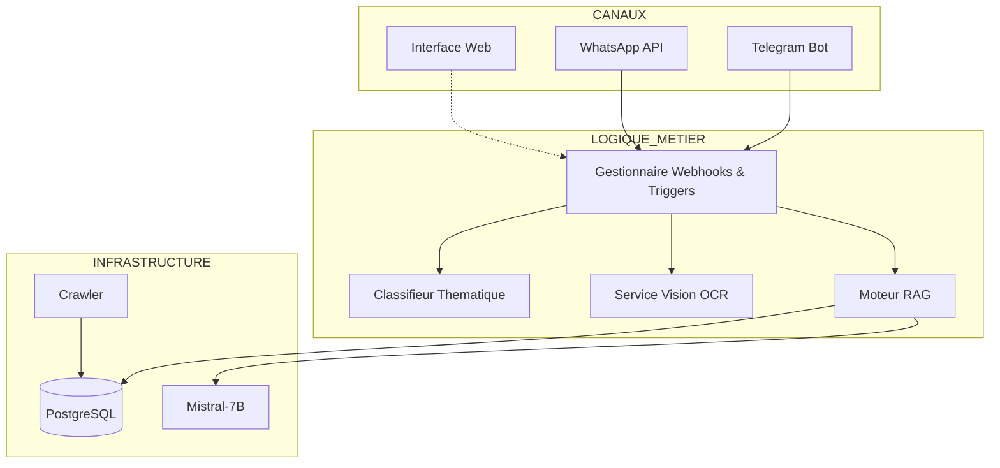
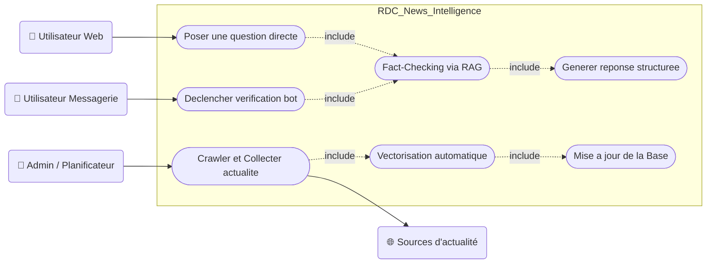
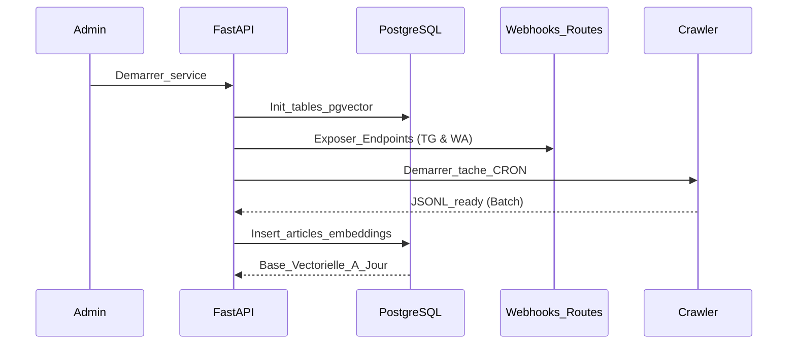
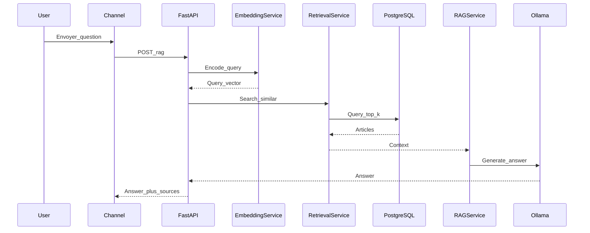
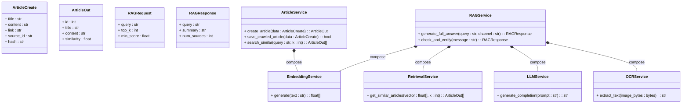
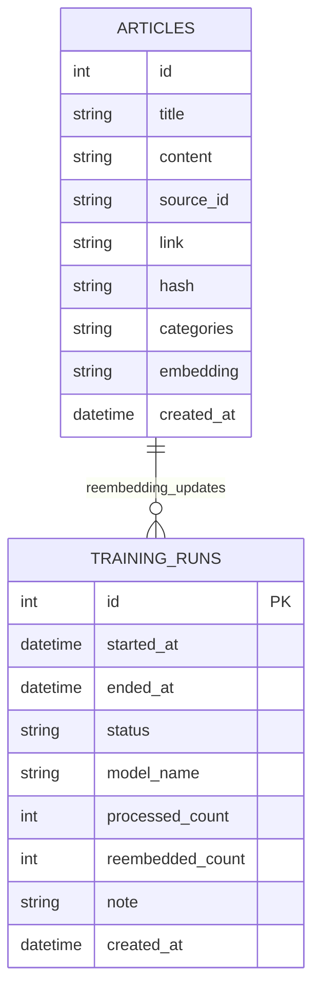
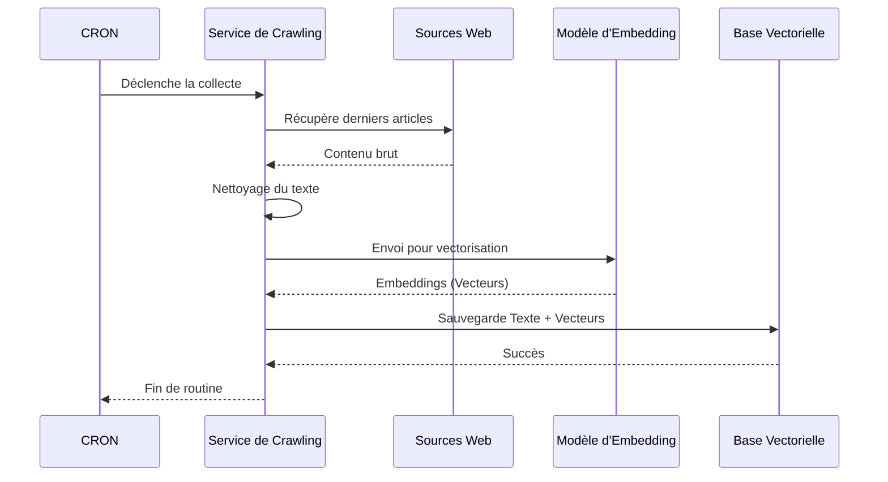
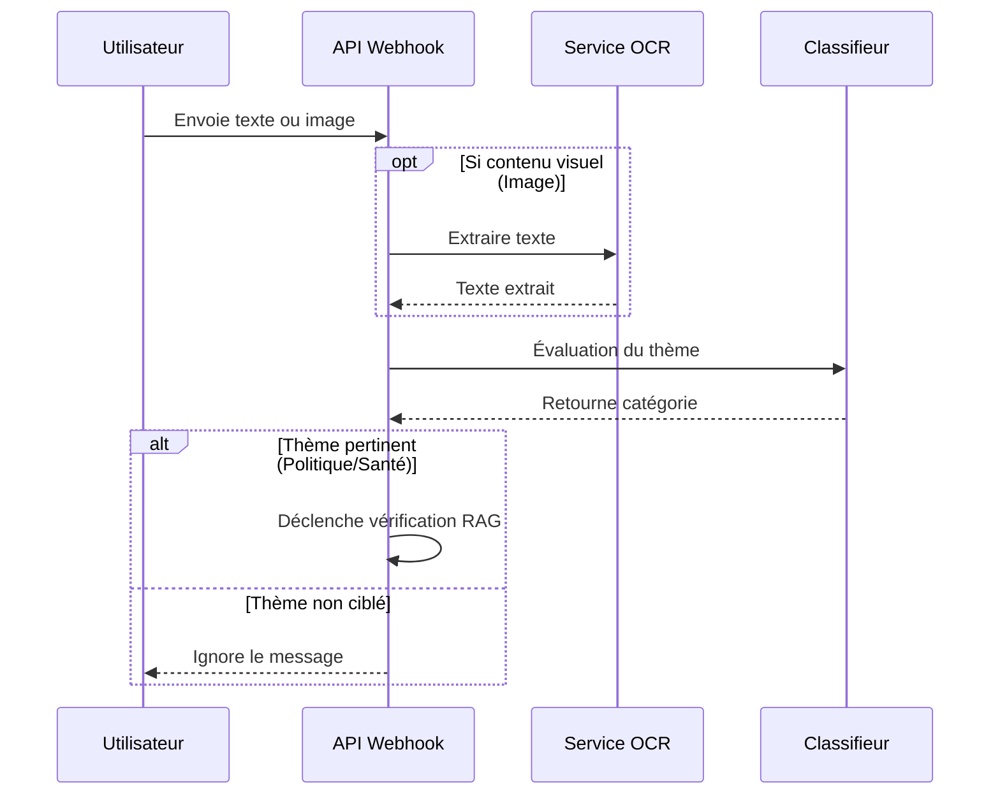
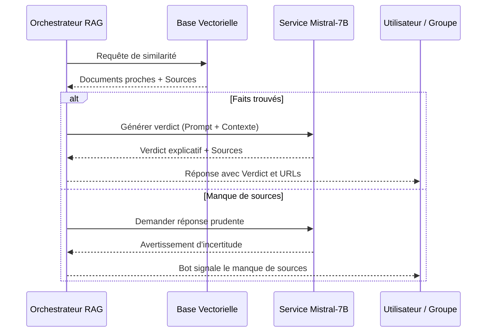

# Chapitre 3 : Modélisation et architecture du système RAG et intégration multicanale

## 3.1. Introduction

Le projet **RDC News Intelligence** repose sur une architecture orientée services dont l'objectif est de transformer un corpus d'actualité en base de connaissance exploitable à la demande. Contrairement à une approche centrée sur le classement statique des sujets, le système proposé combine la recherche sémantique, la récupération ciblée de documents et la génération de réponses contextualisées. Cette combinaison correspond au paradigme **Retrieval-Augmented Generation (RAG)**, qui permet d'ancrer la réponse produite par le modèle de langage dans des sources réelles et actualisées.

L'intérêt d'une telle architecture est particulièrement fort dans un contexte comme celui de la RDC, où les sources sont nombreuses, les contenus redondants et les usages fortement mobiles. Le système doit être capable de répondre rapidement, de fonctionner sur des canaux familiers et d'intégrer des données nouvelles sans redéploiement lourd.

## 3.2. Spécifications du système

### 3.2.1. Spécifications fonctionnelles
Le système doit répondre à plusieurs besoins fonctionnels majeurs :
- **Soumission de requêtes** : Permettre à un utilisateur de soumettre une requête textuelle et d'obtenir une synthèse structurée.
- **Analyse Multimédia** : Accepter une image, extraire le texte par **OCR**, et l'utiliser comme base de recherche.
- **Intégration Multicanale** : Exposer les fonctionnalités via le Web, Telegram et WhatsApp.
- **Intelligence Contextuelle** : Dans les groupes, le bot n'intervient que sur mention ou thématique détectée (Politique, Sport, Santé, Guerre).

### 3.2.2. Spécifications non fonctionnelles
- **Réactivité** : Fournir des réponses rapides pour un usage conversationnel.
- **Confidentialité** : Traitement local (OCR, LLM) pour la souveraineté des données.
- **Robustesse** : Tolérance à l'ajout massif de sources et flexibilité du modèle d'embedding.
- **Maintenabilité** : Séparation stricte entre collecte, indexation et génération.

## 3.3. Cas d'utilisation majeurs

### 3.3.1. Interaction directe (Web)
L'utilisateur interroge directement le système via l'application Web. La question est transmise via l'API REST au composant RAG pour une recherche vectorielle immédiate.

### 3.3.2. Vérification en groupe (Trigger @NewsBot)
Le bot observe les discussions et n'intervient que sur **déclencheur (Trigger)**. Lorsqu'une information douteuse est partagée, un membre mentionne le bot (ex: `@NewsBot vérifie`). Le système renvoie alors un rapport de fact-checking structuré (Verdict, Explication, Sources).

### 3.3.3. Requête par image
L'utilisateur envoie une affiche ou une capture d'écran. Le système extrait le texte sémantique et lance le pipeline de vérification instantanément, atténuant les rumeurs basées sur de faux visuels.

## 3.4. Architecture logicielle

### 3.4.1. Vue d'ensemble de l'architecture

L'application est orchestrée par un noyau **FastAPI** centralisant les flux de données, les routes REST et les Webhooks de messagerie.

> [!NOTE]
> **Architecture Haut Niveau**
> **Type** : Flowchart (Vue logique)
> **Description** : Structure globale montrant la communication entre les canaux d'accès, la couche logique métier et l'infrastructure de données/IA.

## 3.5. Modélisation UML détaillée

### 3.5.1. Diagramme des Cas d'Utilisation

> [!TIP]
> **Modèle d'Interaction Acteurs-Services**
> **Description** : Cartographie fonctionnelle montrant comment les utilisateurs web et messagerie déclenchent les fonctions de Fact-Checking et comment l'administrateur gère le corpus.

### 3.5.2. Séquence de déploiement et de démarrage

> [!IMPORTANT]
> **Cycle de vie initial**
> **Description** : séquence critique de démarrage, de l'initialisation de pgvector à l'exposition des Webhooks et au lancement du premier crawl automatisé.

### 3.5.3. Séquence d'une requête RAG (Fact-Checking)

> [!NOTE]
> **Pipeline Sémantique**
> **Description** : Flux de traitement d'une question, incluant l'encodage, la recherche vectorielle, la synthèse par Ollama (Mistral-7B) et la restitution des sources.

### 3.5.4. Diagramme de classes (Formalisme UML)

> [!TIP]
> **Architecture Logicielle Statique**
> **Description** : Organisation modulaire du code respectant le formalisme UML (attributs typés, méthodes avec types de retour et relations de composition).

### 3.5.5. Schéma de la base de données (ERD)

> [!IMPORTANT]
> **Architecture de Persistance**
> **Description** : Modélisation des tables PostgreSQL, soulignant la colonne vectorielle `embedding` et la traçabilité des entraînements.

### 3.5.6. Diagramme de Séquence du Crawler

> [!NOTE]
> **Ingestion continue**
> **Description** : Processus automatisé de collecte web, vectorisation et synchronisation de la base de connaissances.

### 3.5.7. Séquence d'Interception et Classification

> [!TIP]
> **Intelligence de Groupe**
> **Description** : Logique décisionnelle filtrant les messages par thématique et traitant les images via OCR avant déclenchement du RAG.

### 3.5.8. Séquence de Vérification et Verdict Final

> [!IMPORTANT]
> **Scénarios de réponse**
> **Description** : Confrontation factuelle entre la question et le corpus, menant soit à un verdict sourcé, soit à un flag d'incertitude.

## 3.6. Analyse comparative et stratégie d'apport

### 3.6.1. Comparaison avec les IA existantes (ChatGPT, Perplexity)
Le système RDC News Intelligence se distingue par trois points majeurs :
1. **Élimination des hallucinations** : En bridant l'IA sur un corpus clos, on évite les "inventions" des modèles généralistes.
2. **Curation locale** : Contrairement à Perplexity, le moteur ne cherche que dans des sources vérifiées de la presse congolaise.
3. **Fact-Checking adaptatif** : Si l'info n'est pas dans la base, le système renvoie un flag "NON VÉRIFIABLE" au lieu de tenter de deviner.

### 3.6.2. Stratégie de "Surinformation Contrôlée"
Face à l'immensité de la désinformation, notre approche consiste à occuper l'espace par la **surinformation**. Puisque nous ne pouvons pas arrêter chaque rumeur, nous diffusons massivement des faits vérifiés, rendus ultra-accessibles sur les canaux favoris (WhatsApp/Telegram). En contrôlant la qualité du corpus, nous créons un contre-poids informationnel indispensable pour éduquer et protéger les utilisateurs.

## 3.7. Limites et perspectives futures
Actuellement, le système ne traite pas les **statuts (Stories)** éphémères ou les deepfakes audios. Ces défis constituent les axes de recherche pour les versions futures du projet.

## 3.8. Conclusion partielle
La modélisation montre que RDC News Intelligence est une architecture robuste alliant collecte, sémantique et génération. Le chapitre suivant détaillera l'implémentation technique de ces services.
