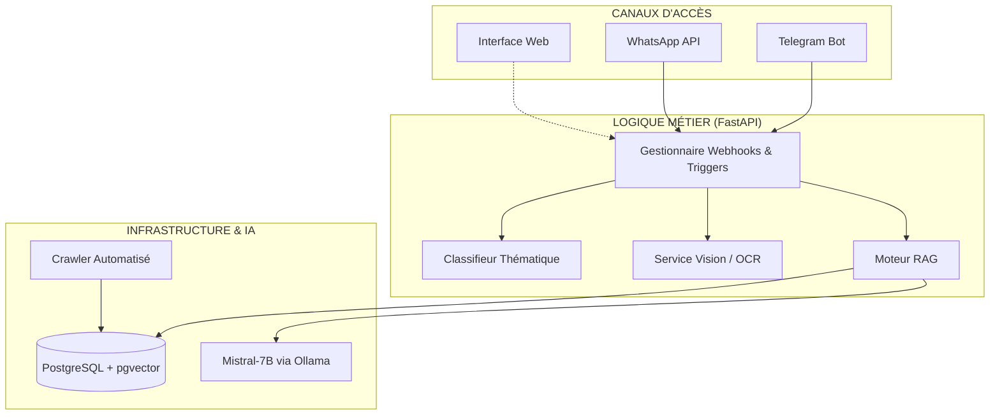
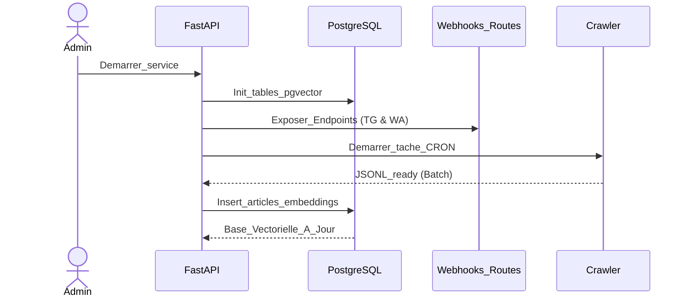
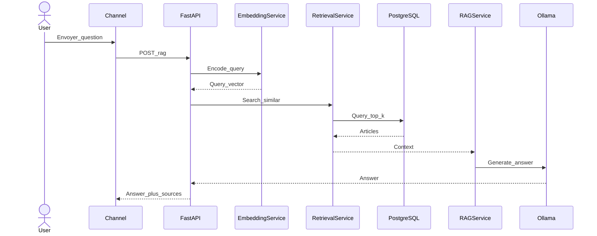
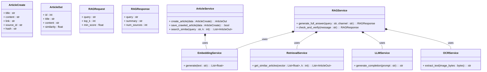
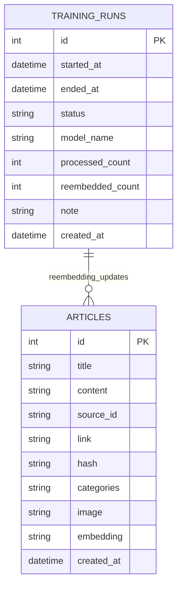
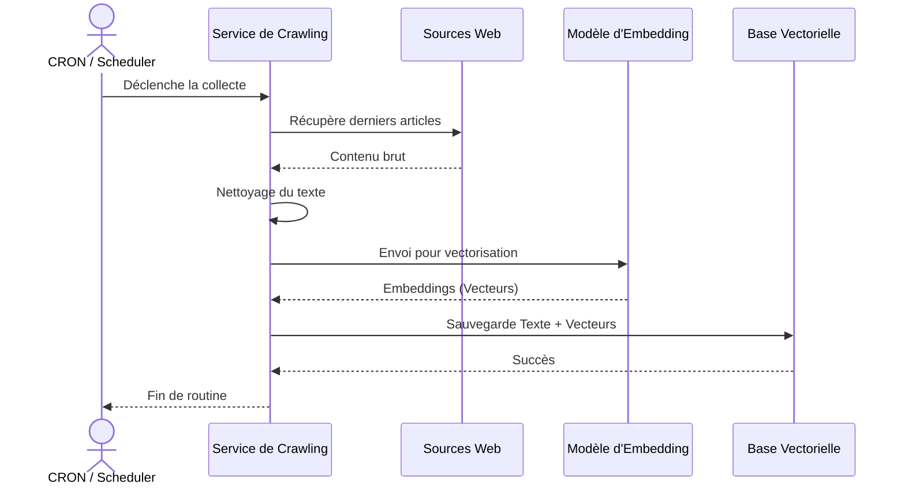
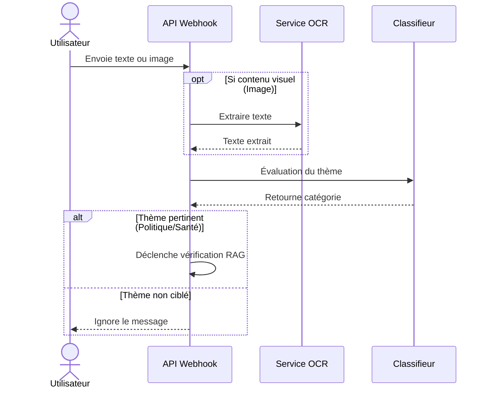
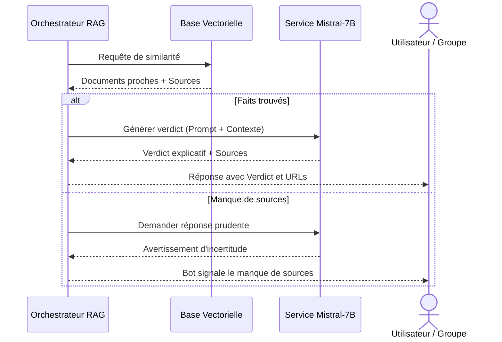

# Chapitre 3 : Modélisation et architecture du système RAG et intégration multicanale

## 3.1. Introduction

Le projet RDC News Intelligence repose sur une architecture orientée services dont l'objectif est de transformer un corpus d'actualité en base de connaissance exploitable à la demande. Contrairement à une approche centrée sur le classement statique des sujets, le système proposé combine la recherche sémantique, la récupération ciblée de documents et la génération de réponses contextualisées. Cette combinaison correspond au paradigme Retrieval-Augmented Generation, ou RAG, qui permet d'ancrer la réponse produite par le modèle de langage dans des sources réelles et actualisées.

L'intérêt d'une telle architecture est particulièrement fort dans un contexte comme celui de la RDC, où les sources sont nombreuses, les contenus redondants et les usages fortement mobiles. Le système doit donc être capable de répondre rapidement, de fonctionner sur des canaux familiers et d'intégrer des données nouvelles sans redéploiement lourd. Le présent chapitre décrit la modélisation du système, ses composants principaux, les cas d'utilisation retenus, le modèle de données et les choix architecturaux qui justifient sa structure.

## 3.2. Spécifications fonctionnelles et non fonctionnelles

### 3.2.1. Spécifications fonctionnelles

Le système doit répondre à plusieurs besoins fonctionnels. Il doit d'abord permettre à un utilisateur de soumettre une requête textuelle et d'obtenir en retour une synthèse structurée fondée sur les articles les plus pertinents. Il doit également accepter une image contenant du texte, extraire le contenu par OCR, puis utiliser ce texte comme base de recherche dans le moteur RAG. En parallèle, il doit exposer ses fonctionnalités via plusieurs interfaces, notamment une interface web, Telegram et WhatsApp. Dans les conversations privées, le système répond à toutes les requêtes; dans les groupes, il n'active le traitement qu'après une évaluation thématique portant sur la politique, le sport, la santé ou la guerre.

Le système doit aussi permettre l'ingestion continue de nouvelles sources. Cette fonction est assurée par le crawler, qui enrichit régulièrement le corpus. Enfin, il doit conserver les articles, leurs métadonnées et leurs embeddings dans une base de données permettant une recherche rapide et cohérente.

### 3.2.2. Spécifications non fonctionnelles

Sur le plan non fonctionnel, plusieurs contraintes ont été retenues. La première est la réactivité. Le système doit fournir des réponses suffisamment rapides pour être utilisable dans un contexte conversationnel. La seconde est la confidentialité, car une partie du traitement est effectuée localement, notamment l'OCR et la génération de texte. La troisième est la robustesse: le système doit tolérer l'ajout de nouvelles sources, de nouveaux articles et, si nécessaire, un changement de modèle d'embedding. La quatrième est la maintenabilité, ce qui suppose une séparation claire entre la collecte, l'indexation, la recherche et la génération.

## 3.3. Cas d'utilisation

### 3.3.1. Interaction directe via l'Interface Web
Le premier cas d'utilisation concerne l'utilisateur (tel qu'un journaliste ou un étudiant) qui interroge directement le système via l'application Web RDC News Intelligence. Il n'y a pas besoin de mention spécifique : la question est posée dans la barre de recherche. L'information ciblée est transmise via l'API REST au composant RAG pour effectuer une recherche vectorielle dans les articles préalablement crawlés, puis le modèle génère une réponse sourcée.

### 3.3.2. Vérification contextuelle dans les Groupes (WhatsApp / Telegram)
Le second cas d'utilisation concerne l'intervention du système au sein d'une discussion de groupe. Face à des informations (souvent redondantes ou suspectes), le bot n'intervient pas systématiquement pour ne pas polluer l'échange.
Le fonctionnement repose sur un **déclencheur (Trigger)** : lorsqu'une information douteuse est partagée, un membre du groupe mentionne le bot (ex: *@NewsBot vérifie* ou *?*). Ce déclencheur capte l'information, la fait transiter par notre Webhook FastAPI, la soumet au RAG et renvoie le rapport de fact-checking directement dans le groupe (avec "VÉRIFICATION", "EXPLICATION" et "SOURCES"). 
Cette logique fait du bot un intervenant pertinent contre la désinformation.

### 3.3.3. Requête par image (Multimédia)
Le dernier cas d'interaction concerne l'analyse d'une image contenant du texte. L'utilisateur envoie une capture d'écran, une affiche ou un visuel partagé. Le système récupère l'image, extrait le texte par OCR, puis applique le même pipeline. Lorsque l'image est accompagnée du déclencheur approprié dans un groupe WhatsApp, le système répond instantanément, mitigant ainsi les rumeurs basées sur de faux visuels.

### 3.3.4. Mise à jour automatique du corpus (Crawler CRON)
Le quatrième cas d'utilisation est l'alimentation continue du corpus. Une tâche asynchrone (CRON) déclenche automatiquement le crawler qui collecte les contenus les plus récents (limités à un batch pour l'efficience), suivit immédiatement du re-embedding. Cela assure que l'IA dispose des faits d'actualité de la journée sans intervention humaine.

## 3.4. Modélisation des données

Le modèle de données est centré sur l'article. Chaque article est caractérisé par son titre, son corps, son URL, sa source, sa date de publication et son embedding. L'embedding constitue l'élément clé du système, car il permet la recherche sémantique. Les sources sont décrites séparément afin de faciliter la gestion des flux et l'ajout de nouvelles origines de données.

La base de données peut également conserver des informations de traçabilité sur les opérations de ré-embedding ou de mise à jour du corpus. Cette décision est utile pour suivre l'évolution du système et pour documenter les changements de modèle ou d'index.

L'usage de PostgreSQL avec pgvector répond à un besoin de simplicité et de cohérence. La base devient à la fois un stockage documentaire et un moteur de recherche vectoriel. Cette approche réduit les dépendances externes et favorise une architecture plus facile à déployer localement.

## 3.5. Architecture logicielle

### 3.5.1. Vue d'ensemble de l'architecture

L'application est organisée autour d'un noyau FastAPI qui orchestre l'ensemble des flux de données. Ce noyau expose des routes de requêtes REST, des webhooks de messagerie asynchrones et des points d'entrée (endpoints) d'ingestion. Autour de ce noyau, plusieurs services spécialisés prennent en charge chaque brique fonctionnelle : la vectorisation sémantique, la recherche dans la base de données, la génération de langage naturel, l'extraction de texte par OCR et la gestion de la persistance des articles.

Cette séparation stricte des responsabilités permet de conserver une structure modulaire où chaque composant remplit un rôle précis et peut évoluer de manière indépendante sans impacter les autres. L'architecture obtenue est ainsi plus lisible, plus maintenable et plus simple à tester unitairement.

**Type de diagramme :** Diagramme d'Architecture Haut Niveau (Flowchart)
**Description détaillée :** Ce diagramme présente la structure globale du système et la communication entre les trois couches principales : les canaux d'accès (Utilisateurs), la couche logique métier (FastAPI) et la couche d'infrastructure (Données et IA). Il illustre comment une requête utilisateur transite par le gestionnaire de webhooks, peut subir un filtrage thématique ou une analyse OCR, avant d'être traitée par le moteur RAG qui interroge la base vectorielle pgvector et le modèle LLM local Mistral-7B.



### 3.5.2. Chaîne de traitement RAG

Lorsqu'une requête arrive, le système suit une chaîne de traitement stable. Le texte est d'abord encodé sous forme vectorielle. Le vecteur est ensuite comparé aux embeddings enregistrés dans la base. Les articles les plus proches sont extraits, puis fournis au service de génération. Ce dernier construit une réponse à partir du contexte récupéré et renvoie un texte structuré vers le canal d'origine.

Cette chaîne constitue le cœur du projet. Elle garantit que la réponse finale ne dépend pas uniquement de la capacité générative du modèle, mais aussi de la qualité du corpus et de la pertinence de la récupération.

### 3.5.3. Intégration multicanale

L'accès au système est prévu sur plusieurs canaux. L'intégration de Telegram et de WhatsApp (via l'API Cloud de Meta) s'effectue exclusivement par des **Webhooks** asynchrones pointant sur la même plateforme FastAPI. Cette architecture en points d'entrée (Endpoints) uniques permet de recevoir les messages en temps réel. Lorsqu'un contexte de groupe est identifiable, les messages du Webhook passent d'abord par le contrôle d'un déclencheur (Trigger) avant tout déclenchement du moteur RAG, alors que l'interface web contourne ce filtre pour conserver une réponse immédiate de recherche.

Cette stratégie centralisée (Webhook) est adaptée au contexte cible, car elle permet de rejoindre les utilisateurs de diverses plateformes via une seule API métier, réduisant massivement les dépendances de déploiement.

## 3.6. Diagrammes UML et schéma de données

Note technique: si la prévisualisation Markdown de VS Code clignote ou masque les blocs Mermaid, ouvrir les versions séparées des diagrammes dans le dossier `diagrams`.
- [diagrams/01-use-cases.mmd](diagrams/01-use-cases.mmd)
- [diagrams/02-deployment-sequence.mmd](diagrams/02-deployment-sequence.mmd)
- [diagrams/03-rag-sequence.mmd](diagrams/03-rag-sequence.mmd)
- [diagrams/04-class-diagram.mmd](diagrams/04-class-diagram.mmd)
- [diagrams/05-erd.mmd](diagrams/05-erd.mmd)

### 3.6.1. Diagramme des Cas d'Utilisation

**Type de diagramme :** Diagramme de Cas d'Utilisation UML
**Description exhaustive :** Ce diagramme constitue la vue fonctionnelle du système RDC News Intelligence. Il permet de cartographier explicitement les interactions entre les acteurs externes et les services internes du moteur RAG. 
- **L'Utilisateur Web** interagit via une interface de recherche directe pour poser des questions complexes, ce qui déclenche systématiquement le processus de Fact-Checking.
- **L'Utilisateur de Messagerie** (WhatsApp/Telegram) opère dans un contexte de groupe où l'interaction est régie par un "Trigger" (@NewsBot) pour éviter le spam, assurant que le bot ne répond qu'aux sollicitations explicites ou thématiques.
- **L'Administrateur** dispose de cas d'utilisation liés à la maintenance du corpus, notamment le déclenchement de la collecte automatisée (Crawling) et le suivi de l'indexation.
Les relations d'inclusion (`include`) soulignent que les fonctions de recherche sémantique, de vectorisation et de mise à jour de la base sont des étapes obligatoires et imbriquées pour garantir la pertinence des réponses générées.

```mermaid
%%{init: {'theme': 'base', 'themeVariables': { 'primaryColor': '#ffffff', 'edgeLabelBackground':'#ffffff', 'tertiaryColor': '#fcfcfc'}}}%%
usecaseDiagram
direction LR

actor "Utilisateur Web" as UserWeb
actor "Utilisateur Messagerie" as UserMsg
actor "Admin / Planificateur" as Admin
actor "Sources d'actualité" as Sources

rectangle "RDC News Intelligence (Moteur RAG)" {
    usecase "Poser une question directe" as UC1
    usecase "Déclencher vérification bot" as UC2
    usecase "Fact-Checking via RAG" as UC3
    usecase "Générer réponse structurée" as UC4
    
    usecase "Crawler & Collecter l'actualité" as UC7
    usecase "Vectorisation automatique" as UC8
    usecase "Mise à jour de la Base" as UC9
}

UserWeb --> UC1
UserMsg --> UC2
UC1 ..> UC3 : include
UC2 ..> UC3 : include
UC3 ..> UC4 : include
Admin --> UC7
UC7 --> Sources
UC7 ..> UC8 : include
UC8 ..> UC9 : include
```

### 3.6.2. Séquence de déploiement et de démarrage

**Type de diagramme :** Diagramme de Séquence UML
**Description exhaustive :** Ce diagramme de séquence détaille les interactions chronologiques lors du démarrage du système RDC News Intelligence. Il met en lumière l'ordre critique des opérations nécessaires pour passer d'un état inactif à un état opérationnel. 
1. **L'Administrateur** lance le service FastAPI.
2. **L'API** configure la base de données PostgreSQL pour supporter les recherches vectorielles (`pgvector`).
3. **Le système** expose les points de terminaison (endpoints) pour les interfaces externes (Telegram et WhatsApp).
4. **Le Crawler** est activé selon une fréquence définie par une tâche CRON pour collecter les articles récents.
5. **La phase finale** est l'ingestion massive des données crawlées (format JSONL) qui subissent une vectorisation immédiate avant d'être persistées en base. Ce flux garantit que dès le démarrage, le système dispose d'une base de connaissances à jour et prête pour la recherche sémantique.



### 3.6.3. Séquence d'une requête RAG (Processus de Fact-Checking)

**Type de diagramme :** Diagramme de Séquence UML
**Description exhaustive :** Ce diagramme décrit le flux de traitement le plus critique du système : la réponse à une interrogation utilisateur. Il décompose l'orchestration entre les différents micro-services sémantiques. 
Dès réception du message, le **FastAPI** sollicite l'**EmbeddingService** pour transformer le texte brut en un vecteur numérique (représentation mathématique du sens). Ce vecteur est ensuite utilisé par le **RetrievalService** pour interroger la base **PostgreSQL** via une recherche de similarité cosinus. Les articles les plus pertinents (le contexte) sont extraits et envoyés au **RAGService**. Ce dernier formule un "prompt" riche (question utilisateur + contexte journalistique) qu'il soumet au modèle **Mistral-7B** hébergé sur **Ollama**. La réponse générée est enfin retournée au canal d'origine, enrichie des sources officielles garantissant la vérifiabilité de l'information.



### 3.6.4. Diagramme de classes (Architecture Logicielle)

**Type de diagramme :** Diagramme de Classes UML
**Description exhaustive :** Ce diagramme présente la structure statique et l'organisation modulaire du code source en respectant le formalisme UML. Il met en évidence la séparation entre les entités de données (Schemas/DTO) et les composants de traitement (Services).
- **Les classes de types (Data Transfer Objects)** : `ArticleCreate`, `ArticleOut`, `RAGRequest` et `RAGResponse` définissent les structures de données avec leurs attributs typés (ex: `title : str`).
- **Les services métiers** : Chaque classe de service liste ses méthodes publiques avec les paramètres d'entrée et les types de retour, conformément aux normes UML. 
- **Les relations** : L'utilisation de la composition (`*--`) indique que le `RAGService` est le pivot central qui orchestre et possède les références vers les services spécialisés de recherche, de génération et de vision.



### 3.6.5. Schéma de la base de données (Architecture de Persistance)

**Type de diagramme :** Diagramme Entité-Relation (ERD)
**Description exhaustive :** Ce diagramme modélise l'organisation physique des données au sein de PostgreSQL. Il met en lumière deux tables pivots pour le système RAG.
1. **La table ARTICLES** : C'est le dépôt central des connaissances. Outre les champs classiques (titre, contenu, source), elle comporte une colonne `embedding` de type vectoriel. C'est ce champ qui permet d'effectuer des recherches de sens plutôt que de simples recherches par mots-clés.
2. **La table TRAINING_RUNS** : Elle assure la traçabilité des opérations de maintenance et de mise à jour du corpus. Chaque "run" enregistre le nombre d'articles traités, le modèle d'IA utilisé pour la vectorisation et le statut du job. 
La relation de un-à-plusieurs (`one-to-many`) entre les deux tables illustre comment une session d'entraînement ou de re-embedding peut impacter et mettre à jour l'ensemble ou une partie des articles du corpus pour en améliorer la précision.



### 3.6.6. Diagramme de Séquence du Crawler (Ingestion continue)

**Type de diagramme :** Diagramme de Séquence UML
**Description exhaustive :** Ce diagramme illustre le flux automatisé qui alimente le système en informations fraîches. Le processus commence par un déclencheur périodique (CRON). Le **Crawler** interroge alors les sources web prédéfinies pour extraire les nouveaux articles. Une fois le contenu récupéré, il subit une phase de nettoyage et de parsing pour ne conserver que le texte utile. Le service de **NLP** entre ensuite en scène pour transformer ce texte en vecteurs numériques. Enfin, ces données enrichies sont persistées dans la **Base Vectorielle**. Ce mécanisme cyclique garantit que l'IA dispose toujours des faits les plus récents de l'actualité congolaise.



### 3.6.7. Séquence d'Interception et de Classification (Intelligence de Groupe)

**Type de diagramme :** Diagramme de Séquence UML
**Description exhaustive :** Un aspect innovant du système est sa capacité à filtrer intelligemment les messages au sein des groupes WhatsApp et Telegram. Ce diagramme décrit la logique décisionnelle du bot pour éviter les réponses inutiles. 
Dès qu'un message (texte ou image) arrive sur le **Webhook**, le système vérifie s'il s'agit d'une image. Le cas échéant, le service **Vision/OCR** extrait le texte contenu dans le visuel. L'ensemble est alors transmis au service de **Classification**. Ce dernier analyse si le sujet appartient aux thématiques prioritaires (Politique, Santé, Sport, Guerre). Si le thème est validé, le pipeline RAG est activé pour une vérification factuelle approfondie. Dans le cas contraire, le message est ignoré, assurant une discrétion optimale du bot.



### 3.6.8. Séquence de Vérification et de Réponse (Verdict Final)

**Type de diagramme :** Diagramme de Séquence UML
**Description exhaustive :** Ce diagramme clôture le cycle de traitement en détaillant la phase de déduction factuelle. L'**Orchestrateur RAG** utilise les documents extraits de la **Base Vectorielle** pour confronter l'affirmation de l'utilisateur. 
Deux scénarios sont possibles : 
1. **Preuves trouvées** : Le service transmet les articles et la question au modèle **Mistral-7B** qui génère un verdict structuré (Vrai/Faux), une explication claire et liste les sources officielles.
2. **Manque de sources** : Si aucun document probant n'est trouvé dans la base vectorielle, le système adopte une posture de prudence. Le LLM génère alors un message d'avertissement indiquant que l'information n'a pas pu être recoupée par les sources fiables du corpus. Cette rigueur permet d'éviter la propagation de rumeurs et les hallucinations de l'IA.



## 3.7. Justification des choix d'architecture

Le choix d'une architecture RAG est motivé par la nécessité d'ancrer les réponses dans des sources réelles et de garder la possibilité de mise à jour continue. Le choix de pgvector permet une recherche locale, rapide et maîtrisée. L'usage d'Ollama et de modèles locaux limite la dépendance à des services externes et renforce la souveraineté des données. L'intégration d'un crawler garantit enfin que le corpus se renouvelle sans intervention lourde.

Ces choix sont cohérents avec l'objectif du projet: proposer un système utile, mobile et adapté au contexte congolais, sans imposer une infrastructure trop coûteuse ou trop dépendante du cloud.

## 3.8. Apport du Système face aux IA existantes (Perplexity, ChatGPT)

Il est légitime de s'interroger sur la pertinence d'un nouveau système d'intelligence artificielle face à des géants très établis.

1. **La limitation des IA Généralistes (Type ChatGPT) :**
ChatGPT s'appuie sur une base de connaissances non localisée. Lorsqu'on l'interroge sur des événements précis ou très récents à l'Est de la RDC, le modèle manque de contexte local (données primaires) et peut **halluciner** des informations plausibles mais inexactes, un écueil que l'on qualifie souvent d'"arrogance du LLM".

2. **La limitation des moteurs de recherche RAG généralistes (Type Perplexity AI) :**
Bien que connecté au Web en temps réel pour contrer l'obsolescence, Perplexity AI récupère l'information sans validation humaine préalable. Il s'appuiera de la même manière sur une agence de presse respectée que sur un blog d'opinion ou un site de fake news bien référencé. Il peut donc propager de l'infobésité.

3. **La force de RDC News Intelligence : L'écosystème clos ciblé.**
L'innovation majeure de notre système réside dans son intégration ciblée (au cœur des groupes WhatsApp où sévit la désinformation) et dans sa restriction ("Bridage") sur un **Corpus Clos**. L'IA n'extrait sa vérité que d'une base de données de presse congolaise filtrée par notre propre index. Si l'information ne s'y trouve pas, l'IA renvoie un flag d'incertitude strict ("NON VÉRIFIABLE"), constituant l'outil ultime de Fact-Checking adapté au marché local.

4. **Combattre la désinformation par la "Surinformation Contrôlée" :**
Face à l'immensité de la désinformation qui se propage de manière incontrôlable, notre approche stratégique ne consiste pas seulement à démentir, mais à occuper l'espace informationnel par la **surinformation**. Puisque nous ne pouvons pas arrêter chaque fake news à la racine, nous avons opté pour la diffusion massive d'informations vérifiées et sourcées, rendues beaucoup plus accessibles que la rumeur. En contrôlant la qualité du corpus que nos utilisateurs consomment, nous créons un contre-poids informationnel. Cette stratégie repose sur l'idée que la meilleure défense contre un mensonge viral est une vérité encore plus accessible, plus rapide et plus présente dans le quotidien numérique des citoyens.

## 3.9. Limites du système et perspectives futures

Bien que l'architecture proposée apporte une solution concrète et opérationnelle, ce travail présente des limites inhérentes à la complexité de l'environnement numérique congolais :

1. **Les formats fermés et éphémères :** Actuellement, le système ne capte et ne traite pas toutes les sources primaires par lesquelles la désinformation transite. Les statuts personnels (Stories WhatsApp) ou les diffusions descendantes (Canaux / Chaînes WhatsApp et Telegram) nécessitent des stratégies d'interception très différentes, souvent bloquées par les politiques de confidentialité strictes des plateformes.
2. **L'immensité de la désinformation :** La désinformation est un phénomène sociétal extrêmement vaste, multilangue, et polymorphe (vidéos truquées, audios vocaux, deepfakes). Notre approche se concentre efficacement sur le texte et les images textuelles, mais cet océan d'infobésité dépasse de loin le cadre technique de cette première implémentation.

Ces contraintes identifiées constituent d'ores et déjà les axes de développement prioritaires pour les recherches et mises à jour futures du système RDC News Intelligence.

## 3.10. Conclusion partielle

La modélisation du système montre que RDC News Intelligence n'est pas seulement un chatbot, mais une architecture complète de collecte, d'indexation et de génération de réponses. Le couplage entre crawler, embeddings, base vectorielle et modèle de langage permet d'obtenir une solution souple et orientée usage. Le chapitre suivant présentera la mise en œuvre technique de cette architecture, les composants réellement développés et les résultats observés lors des tests.
