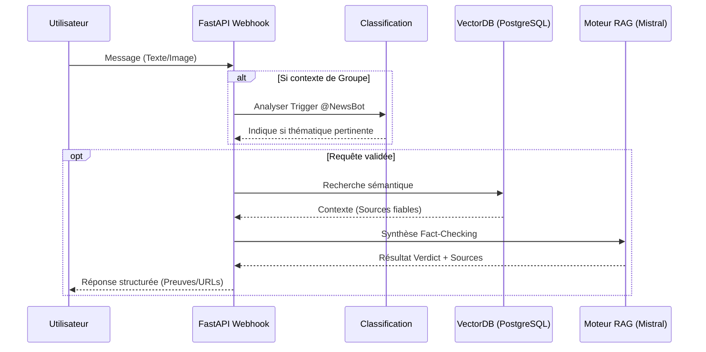

# Chapitre 4 : Implémentation, intégration multicanale et déploiement

## 4.1. Introduction

Après la modélisation architecturale, il convient de décrire la mise en œuvre concrète du système. Ce chapitre présente les principaux composants implémentés dans le projet **RDC News Intelligence**, les technologies utilisées, l'organisation du code, les mécanismes d'intégration multicanale et les opérations de maintenance qui permettent au système de rester fonctionnel et à jour.

L'objectif est d'expliquer comment les choix techniques du chapitre précédent ont été traduits en services réels, en routes d'API et en scripts d'ingestion.

## 4.2. Stack technologique et environnement

Le backend repose sur **FastAPI**, choisi pour sa rapidité et sa capacité à gérer des flux asynchrones. La base de données principale est **PostgreSQL**, complétée par l'extension **pgvector** pour la recherche vectorielle sémantique. Les embeddings sont produits par **SentenceTransformers**, tandis que la génération de réponses est assurée par un modèle local exécuté via **Ollama (Mistral-7B)**.

Le traitement **OCR** est assuré par **Tesseract**, permettant l'analyse d'images. Les interactions utilisateurs passent par **Telegram** (polling) et **WhatsApp** (Webhooks Cloud API Meta). Un service de décision thématique filtre les messages pour n'activer le bot que sur les sujets sensibles (Politique, Santé, etc.).

## 4.3. Organisation du code et services

L'architecture suit une séparation stricte entre les points d'entrée (API/Webhooks) et la logique métier (Services) :
- **Routes API** : Gèrent les requêtes REST, les webhooks WhatsApp/Telegram et l'administration.
- **Services Métiers** : Encapsulent la vectorisation, la recherche, la génération, l'OCR et le filtrage thématique.
- **Service Article** : Gère la persistance et l'indexation sémantique automatique.
- **Pipeline d'Entraînement** : Permet le recalcul des embeddings (re-embedding) pour améliorer la précision globale.

## 4.4. Flux d'exécution principaux

Les flux d'exécution décrivent le parcours de l'information à travers les différentes couches logiques du système.

> [!NOTE]
> **Synthèse Globale du Flux d'Exécution**
> **Description** : Diagramme récapitulatif montrant le traitement d'une requête, de la GateWay Webhook jusqu'à la restitution finale par le moteur RAG.

### 4.4.1. Parcours de la requête textuelle
Lorsqu'un utilisateur pose une question, le texte est normalisé et vectorisé. Si le contrôle thématique l'autorise, le vecteur est comparé au corpus via PostgreSQL. Les articles extraits servent alors de "mémoire contextuelle" au modèle Mistral-7B pour générer une réponse synthétique évitant toute hallucination.

### 4.4.2. Traitement des flux multimédias (OCR)
Pour les images, le flux intègre une étape supplémentaire : le téléchargement du média suivi de l'extraction par **OCR**. Le contenu textuel obtenu rejoint ensuite la file de traitement classique (classification puis RAG), permettant de vérifier des captures d'écran ou des affiches suspectes partagées dans les groupes.

### 4.4.3. Ingestion asynchrone (Crawler)
Le crawler collecte les articles, produit un format **JSONL**, puis les réinjecte dans le service d'IA pour indexation. Ce flux asynchrone garantit que la base de connaissances reste alimentée en temps réel sans impacter les performances des requêtes utilisateurs.

## 4.5. Maintenance et évolution du corpus
La force du projet réside dans sa capacité de mise à jour. Une opération de **ré-embedding** complète peut être lancée pour rafraîchir l'index sémantique. Le crawler automatique, quant à lui, assure la fraîcheur continue des données pour le moteur de recommandation.

## 4.6. Résultats et limites
Les tests valident la précision de la recherche vectorielle. Cependant, le système ne traite pas encore les **stories** WhatsApp ou les messages audios, ce qui constitue une opportunité pour les versions futures.

## 4.7. Conclusion partielle
La traduction technique des modèles montre que **RDC News Intelligence** est une solution complète, alliant collecte intelligente, recherche sémantique et génération robuste, le tout intégré de manière transparente dans les outils de communication quotidiens des utilisateurs congolais. Le système obtenu constitue une base solide pour une évolution ultérieure vers des usages plus avancés, notamment la détection de tendances, l'analyse de qualité des sources et l'assistance éditoriale.
