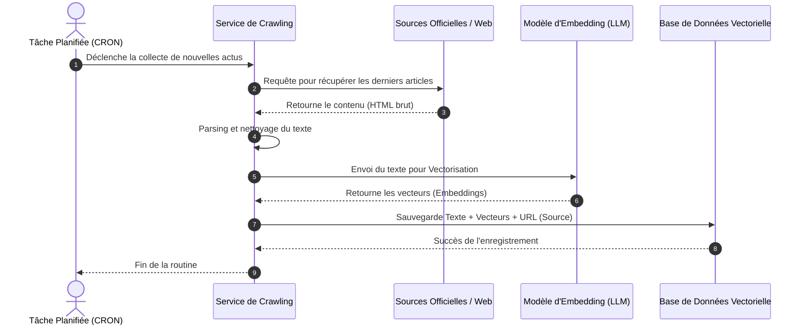
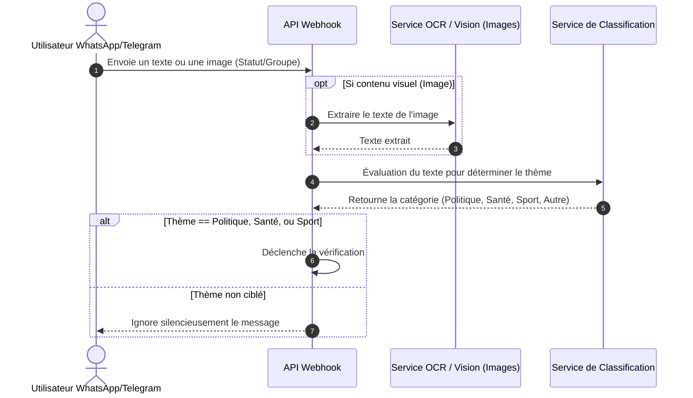
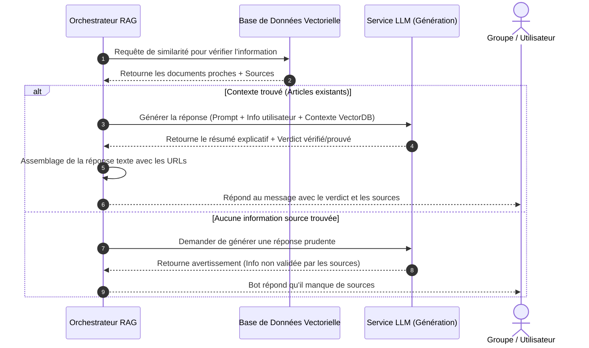
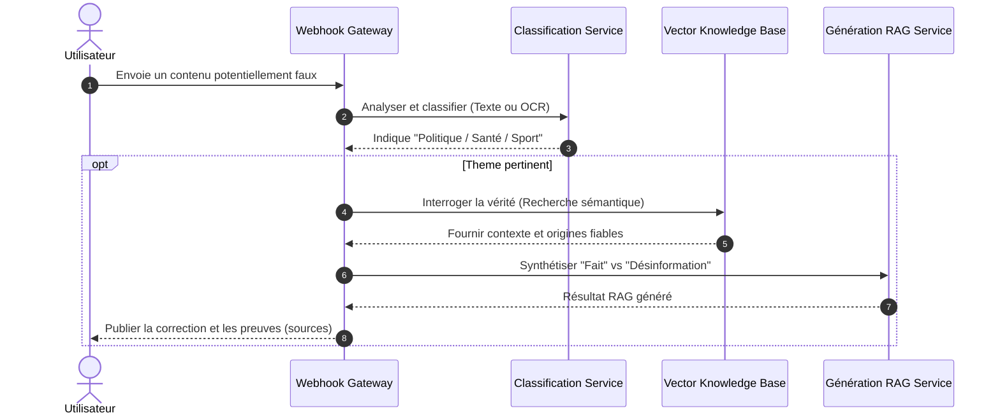

# Modélisation du Système d'Intelligence et de Lutte contre la Désinformation

Voici l'ensemble des diagrammes demandés, modélisés avec la syntaxe **Mermaid**. 

> **Comment utiliser ces diagrammes dans Draw.io ?**
> 1. Ouvrez [Draw.io](https://app.diagrams.net/).
> 2. Allez dans le menu : **Plus (Arrange) > Insérer (Insert) > Avancé (Advanced) > Mermaid...**
> 3. Copiez-collez le code des blocs ci-dessous pour générer instantanément les diagrammes au format Draw.io, que vous pourrez éditer et enregistrer au format `.drawio`.

---

## 1. Diagramme des Cas d'Utilisation

Ce diagramme présente les interactions globales entre les acteurs et le système pour le Crawler et le Chatbot.

```mermaid
%%{init: {'theme': 'base', 'themeVariables': { 'primaryColor': '#ffffff', 'edgeLabelBackground':'#ffffff', 'tertiaryColor': '#fcfcfc'}}}%%
usecaseDiagram
direction LR

actor "Utilisateur (WhatsApp/Telegram)" as User
actor "Administrateur / Planificateur (CRON)" as Admin
actor "Sources d'actualité (Web/RSS)" as Sources

rectangle "Système de Recommandation et Vérification" {
    usecase "Envoyer un message ou statut (Texte/Image)" as UC1
    usecase "Intercepter et Analyser l'information" as UC2
    usecase "Classifier le thème (Politique, Santé, Sport)" as UC3
    usecase "Vérifier la véracité via Vector DB" as UC4
    usecase "Générer un résumé pertinent (RAG)" as UC5
    usecase "Répondre avec verdict et sources" as UC6
    
    usecase "Crawler les informations" as UC7
    usecase "Vectoriser les données (Embedding)" as UC8
    usecase "Mettre à jour la Base de Connaissances" as UC9
}

User --> UC1
User <-- UC6 : Reçoit la réponse argumentée

UC1 ..> UC2 : inclut
UC2 ..> UC3 : inclut
UC3 ..> UC4 : si thème du domaine (Polit., Santé, Sport)
UC4 ..> UC5 : inclut
UC5 ..> UC6 : inclut

Admin --> UC7
UC7 --> Sources : Collecte des faits
UC7 ..> UC8 : inclut
UC8 ..> UC9 : inclut

UC4 --> UC9 : Consulte la base
```

---

## 2. Diagramme de Séquence du Crawler (Alimentation DB)

Ce diagramme montre les étapes pour le crawler.



---

## 3. Diagramme de Séquence : Action d'Interception et de Classification

Action déclenchée dès qu'un utilisateur poste sur le groupe.



---

## 4. Diagramme de Séquence : Action de Vérification et de Réponse (RAG)

Suite de l'action d'interception, si pertinente.



---

## 5. Diagramme de Séquence Générale (Vue Complète)


