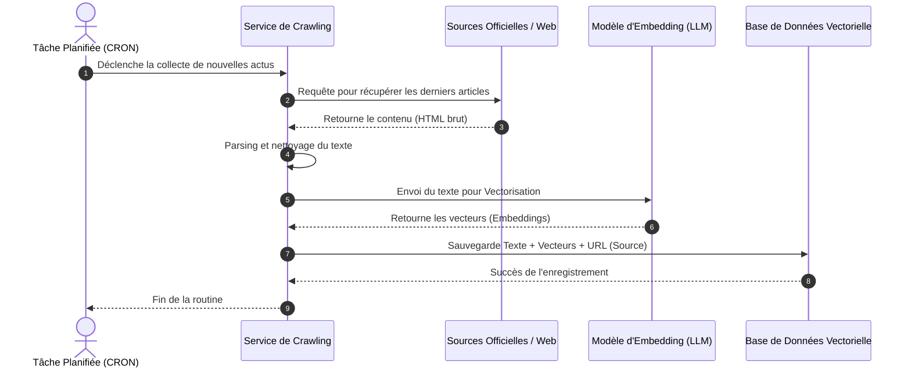
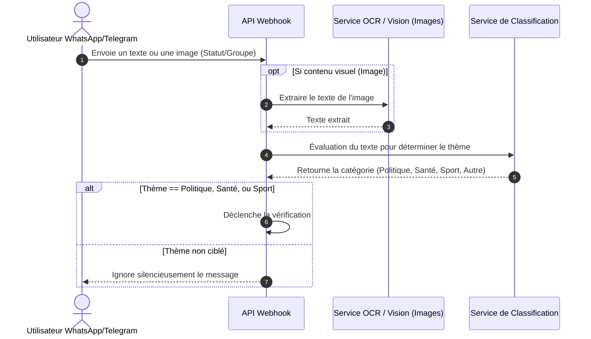
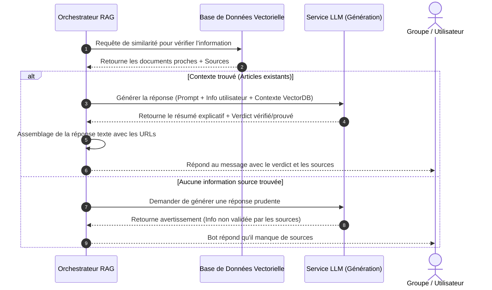
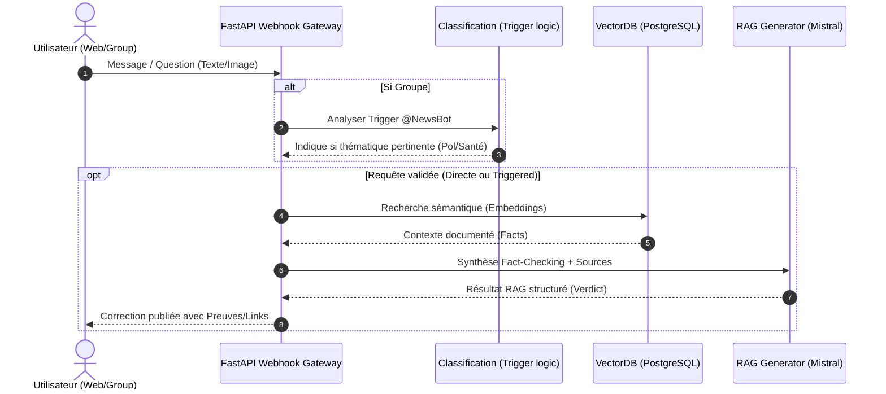

# Modélisation du Système d'Intelligence et de Lutte contre la Désinformation

Voici l'ensemble des diagrammes demandés, modélisés avec la syntaxe **Mermaid**. 

> **Comment utiliser ces diagrammes dans Draw.io ?**
> 1. Ouvrez [Draw.io](https://app.diagrams.net/).
> 2. Allez dans le menu : **Plus (Arrange) > Insérer (Insert) > Avancé (Advanced) > Mermaid...**
> 3. Copiez-collez le code des blocs ci-dessous pour générer instantanément les diagrammes au format Draw.io, que vous pourrez éditer et enregistrer au format `.drawio`.

---

## 1. Diagramme des Cas d'Utilisation

Ce diagramme présente les interactions globales entre les acteurs et le système pour le Crawler et le Chatbot.

```mermaid
%%{init: {'theme': 'base', 'themeVariables': { 'primaryColor': '#ffffff', 'edgeLabelBackground':'#ffffff', 'tertiaryColor': '#fcfcfc'}}}%%
usecaseDiagram
direction LR

actor "Utilisateur Web" as UserWeb
actor "Utilisateur Messagerie (Groupes)" as UserMsg
actor "Admin / Planificateur (CRON)" as Admin
actor "Sources d'actualité (Web/RSS)" as Sources

rectangle "RDC News Intelligence (Moteur RAG)" {
    usecase "Poser une question directe" as UC1
    usecase "Déclencher vérification (@NewsBot / Trigger)" as UC2
    usecase "Fact-Checking via RAG (Contexte Vectoriel)" as UC3
    usecase "Générer réponse structurée (Vrai/Faux + Sources)" as UC4
    
    usecase "Crawler & Collecter l'actualité" as UC7
    usecase "Vectorisation automatique (Embedding)" as UC8
    usecase "Mise à jour de la Base (Continuous Learning)" as UC9
}

UserWeb --> UC1
UserMsg --> UC2 : Optionnel (Trigger-based)

UC1 ..> UC3 : include
UC2 ..> UC3 : include
UC3 ..> UC4 : include

UserWeb <-- UC4 : Réponse complète
UserMsg <-- UC4 : Verdict + Sources

Admin --> UC7
UC7 --> Sources : Collecte
UC7 ..> UC8 : include
UC8 ..> UC9 : include

UC3 --> UC9 : Recherche sémantique
```

---

## 2. Diagramme de Séquence du Crawler (Alimentation DB)

Ce diagramme montre les étapes pour le crawler.



---

## 3. Diagramme de Séquence : Action d'Interception et de Classification

Action déclenchée dès qu'un utilisateur poste sur le groupe.



---

## 4. Diagramme de Séquence : Action de Vérification et de Réponse (RAG)

Suite de l'action d'interception, si pertinente.



---

## 5. Diagramme de Séquence Générale (Vue Complète)


