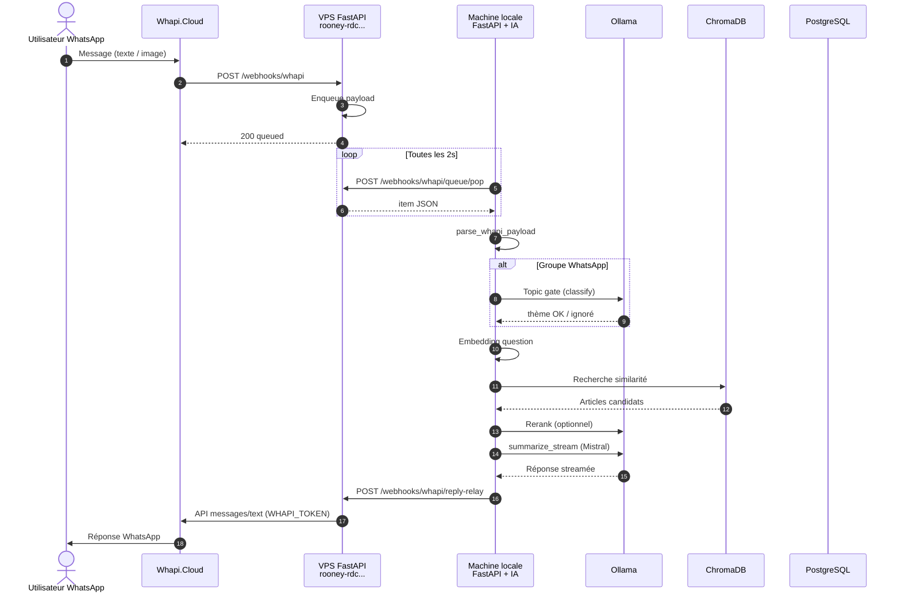

# Flux WhatsApp → serveur en ligne → machine locale → restitution

Document **explicatif** pour construire un diagramme **draw.io** (ou FigJam, Lucidchart). Il décrit le parcours d’un message depuis **WhatsApp** jusqu’à la **réponse renvoyée**, en passant par ton **VPS public** (`rooney-rdc.rooneykalumba.tech`) et le traitement **local** (RAG, ChromaDB, Ollama).

---

## 1. Vue d’ensemble (3 zones à dessiner)

| Zone | Rôle | Exemples dans ton projet |
|------|------|---------------------------|
| **A — Messagerie** | Utilisateur, groupe WhatsApp | Message texte ou image dans un groupe |
| **B — Serveur en ligne (VPS)** | Reçoit les webhooks publics, file d’attente, relais des réponses | FastAPI sur `https://rooney-rdc.rooneykalumba.tech` |
| **C — Machine locale** | IA lourde : embeddings, ChromaDB, Mistral (Ollama), pas besoin d’être exposée sur Internet | `dev-all.sh` / uvicorn en local, `ENABLE_WHAPI_QUEUE_POLLING=true` |

**Principe :** le VPS ne fait **pas** (ou peu) d’inférence IA en mode proxy ; il **stocke** le JSON entrant et **relaye** la réponse vers Whapi / Meta.

---

## 2. Deux entrées possibles (choisir une branche sur le draw.io)

### Branche A — **Whapi.Cloud** (configuration actuelle dans tes logs)

```
Utilisateur WhatsApp
    → Whapi.Cloud (passerelle)
    → POST https://rooney-rdc.../webhooks/whapi   [VPS]
    → file mémoire (queue)
    → polling local POST .../whapi/queue/pop      [LOCAL]
    → traitement RAG
    → POST .../whapi/reply-relay                  [VPS]
    → Whapi API (gate.whapi.cloud)
    → Utilisateur WhatsApp
```

### Branche B — **WhatsApp Cloud API (Meta)**

```
Utilisateur WhatsApp
    → Meta (graph.facebook.com)
    → POST https://rooney-rdc.../webhooks/whatsapp   [VPS]
    → file ou forward
    → polling local POST .../whatsapp/queue/pop       [LOCAL]
    → traitement RAG
    → POST .../whatsapp/reply-relay                 [VPS]
    → Meta envoie le message
    → Utilisateur WhatsApp
```

Sur le diagramme, tu peux mettre **Whapi** en trait plein et **Meta** en pointillés, ou deux pages draw.io.

---

## 3. Séquence détaillée (Whapi + mode PULL — recommandé)

Numérotation utile pour les flèches du diagramme de séquence.

| # | Acteur | Action | Détail technique |
|---|--------|--------|------------------|
| 1 | Utilisateur | Envoie un message (texte / image) | Groupe ou chat privé |
| 2 | Whapi | Notifie ton backend | Webhook configuré dans le dashboard Whapi |
| 3 | VPS | `POST /webhooks/whapi` | `WHAPI_WEBHOOK_PROXY_ONLY=true` → **pas de RAG sur le VPS** |
| 4 | VPS | `_enqueue_whapi_payload()` | JSON brut en **file mémoire** (`deque`) |
| 5 | VPS | Répond `200 { "status": "queued" }` | Whapi considère le webhook OK |
| 6 | Local | Worker `run_whapi_queue_polling()` | Boucle toutes les ~2 s (`WHAPI_QUEUE_POLL_INTERVAL`) |
| 7 | Local | `POST WHAPI_QUEUE_POP_URL` | Ex. `https://rooney-rdc.../webhooks/whapi/queue/pop` + header `X-RDC-Queue-Token` |
| 8 | VPS | `queue/pop` renvoie `{ "item": <payload> }` | Un message à la fois (FIFO) |
| 9 | Local | `_dispatch_whapi_payload` → `parse_whapi_payload` | Ignore statuts, `from_me`, payloads vides |
| 10 | Local | `process_whatsapp_message` ou `process_whatsapp_image` | `transport="whapi"` |
| 11 | Local | **Topic gate** (si groupe) | `TopicGateService.classify` — mots-clés + Ollama ; sinon message ignoré |
| 12 | Local | **RAG** `RAGService.generate_answer_stream` | Voir § 4 |
| 13 | Local | `_send_whatsapp_text` / chunks | `transport="whapi"` |
| 14 | Local | `POST WHAPI_REPLY_RELAY_URL` | Corps `{ "to": chat_id, "body": "..." }` + `X-RDC-Relay-Token` |
| 15 | VPS | `POST /webhooks/whapi/reply-relay` | Utilise `WHAPI_TOKEN` pour appeler **gate.whapi.cloud** |
| 16 | Whapi | Délivre sur WhatsApp | L’utilisateur voit la réponse (éventuellement en plusieurs bulles) |

---

## 4. Traitements **uniquement en local** (bloc à encadrer sur draw.io)

Ces étapes consomment CPU/RAM ; c’est là qu’Ollama et les modèles tournent.

```
Message texte (query)
    │
    ├─► [Option groupe] TopicGateService
    │       • Mots-clés dynamiques (politique, sport, santé, guerre) depuis Postgres
    │       • Classification IA via Ollama (http://127.0.0.1:11434)
    │       • Si hors sujet → STOP (pas de RAG)
    │
    └─► RAGService.generate_answer_stream (channel=whatsapp)
            │
            ├─► 1. EmbeddingService
            │       sentence-transformers (paraphrase-multilingual-MiniLM-L12-v2)
            │       Vecteur 384 dim de la question
            │
            ├─► 2. RetrievalService → VectorStoreService (ChromaDB)
            │       Fichier local : ai-service/data/chroma_db
            │       Collection : articles_rdc
            │       Recherche cosinus → ~9 candidats (top_k × 3)
            │
            ├─► 3. [Option] LLMService.rerank (Ollama / Mistral)
            │       Re-score les articles (JSON scores)
            │
            ├─► 4. Filtrage similarité (seuil ~0.40 pour whatsapp)
            │       Garde top_k articles (souvent 3)
            │
            └─► 5. LLMService.summarize_stream (Ollama / Mistral)
                    Prompt fact-check (VÉRIFICATION / EXPLICATION / SOURCES)
                    Streaming → buffer → envoi par morceaux WhatsApp
```

### Cas **image**

| Étape | Service |
|-------|---------|
| Téléchargement / data URI | URL Whapi ou preview `data:image` |
| OCR | `OCRService` (Tesseract + Pillow) |
| Puis | Même pipeline RAG avec le **texte extrait** |

### Données consultées (local + réseau)

| Composant | Rôle |
|-----------|------|
| **PostgreSQL** | Métadonnées articles (titre, contenu, lien, source) — pas la recherche vectorielle |
| **ChromaDB** | Index sémantique (embeddings des articles) |
| **Ollama** | Génération réponse + rerank + topic gate |

---

## 5. Endpoints HTTP (étiquettes pour les flèches draw.io)

### Sur le **VPS** (public)

| Méthode | Chemin | Rôle |
|---------|--------|------|
| POST | `/webhooks/whapi` | Réception webhook Whapi → enqueue |
| POST | `/webhooks/whapi/queue/pop` | Le local **tire** un message de la file |
| POST | `/webhooks/whapi/reply-relay` | Le local **pousse** la réponse ; le VPS appelle Whapi |
| POST | `/webhooks/whatsapp` | Équivalent Meta |
| POST | `/webhooks/whatsapp/queue/pop` | Polling file Meta |
| POST | `/webhooks/whatsapp/reply-relay` | Relais vers Graph API Meta |
| GET | `/health` | Santé du service (`ready: true` si bootstrap OK) |

### Sur le **local** (souvent non exposé)

| Composant | URL typique |
|-----------|-------------|
| FastAPI | `http://127.0.0.1:8000` |
| Ollama | `http://127.0.0.1:11434` |
| Postgres | `localhost:5432` (selon `.env`) |

---

## 6. Variables d’environnement par zone (légende du diagramme)

### VPS (serveur en ligne)

```env
WHAPI_WEBHOOK_PROXY_ONLY=true
WHAPI_QUEUE_TOKEN=secret-queue
WHAPI_REPLY_RELAY_TOKEN=secret-relay
WHAPI_TOKEN=<sur le VPS uniquement — envoi Whapi>
```

### Local (ta machine de dev)

```env
ENABLE_WHAPI_QUEUE_POLLING=true
WHAPI_QUEUE_POP_URL=https://rooney-rdc.rooneykalumba.tech/webhooks/whapi/queue/pop
WHAPI_REPLY_RELAY_URL=https://rooney-rdc.rooneykalumba.tech/webhooks/whapi/reply-relay
WHAPI_QUEUE_TOKEN=secret-queue
WHAPI_REPLY_RELAY_TOKEN=secret-relay

OLLAMA_HOST=http://127.0.0.1:11434
OLLAMA_MODEL=mistral
```

*(Ne pas mettre de vrais tokens sur le diagramme public — utiliser « secret » ou « … ».)*

---

## 7. Modèle draw.io suggéré

### Type de diagramme

**Diagramme de séquence** avec **4 swimlanes** (colonnes) :

1. **Utilisateur / WhatsApp**
2. **Whapi** (ou **Meta**)
3. **VPS — FastAPI** (`rooney-rdc.rooneykalumba.tech`)
4. **Local — FastAPI + IA**

### Couleurs (proposition)

| Élément | Couleur |
|---------|---------|
| Réseau public (HTTPS) | Bleu |
| File / queue sur VPS | Orange |
| Traitement IA local | Vert |
| Bases de données | Gris |

### Formes

- **Rectangle** : service (FastAPI, RAGService, ChromaDB…)
- **Cylindre** : Postgres, ChromaDB
- **Flèche pointillée** : polling (local → VPS toutes les 2 s)
- **Flèche pleine** : webhook entrant ou réponse sortante
- **Note** : « RAM Ollama ~4 Go », « proxy_only : pas de RAG sur VPS »

### Fichier draw.io existant à réutiliser

Le dépôt contient déjà des bases dans `ai-service/docs/` :

- `02-deployment-sequence.drawio` — démarrage
- `Diagramme_Sequence_Verification.drawio` / `03-rag-sequence.drawio` — cœur RAG
- `Diagramme_Sequence_Interception.drawio` — topic gate / OCR

Tu peux **dupliquer** `Diagramme_Sequence_Generale.drawio` (si présent) ou créer **`06-whatsapp-proxy-local.drawio`** en copiant la structure ci-dessus.

---

## 8. Diagramme Mermaid (brouillon → recopier dans draw.io)



---

## 9. Erreurs fréquentes (notes en bas du draw.io)

| Symptôme | Cause probable |
|----------|----------------|
| Pas de réponse | `ENABLE_WHAPI_QUEUE_POLLING` désactivé en local |
| 404 sur `/admin/overview` | Bootstrap FastAPI échoué (ex. `python-multipart` manquant) |
| Ollama 500 « 4.3 GiB » | RAM insuffisante pour Mistral — modèle quantifié plus petit |
| Topic gate error 500 | Ollama indisponible ou saturé |
| Relay 200 mais pas de message | `WHAPI_TOKEN` absent sur le **VPS** |
| Double réponse | `PROXY_ONLY` désactivé sur VPS **et** traitement local actif |

---

## 10. Résumé en une phrase

**Whapi envoie le message au VPS qui le met en file ; ta machine locale récupère ce message, fait la recherche dans ChromaDB et la rédaction avec Ollama, puis renvoie le texte au VPS qui l’expédie via Whapi jusqu’à WhatsApp.**

---

## Fichiers code de référence

| Fichier | Contenu |
|---------|---------|
| `app/api/routes/webhooks.py` | Webhooks, queue, relay, `process_whatsapp_message` |
| `app/services/rag_service.py` | Pipeline RAG |
| `app/services/vector_store_service.py` | ChromaDB |
| `app/services/llm_service.py` | Ollama / Mistral |
| `app/services/topic_gate_service.py` | Filtre thématique groupes |
| `app/main.py` | Démarrage polling + logs startup |
| `docs/README.md` | Variables WhatsApp Meta (mode PULL) |
