# Diagrammes UML (Mermaid) — Chapitre III

Fichier de référence pour recréer les diagrammes dans **draw.io** (ou FigJam).  
Chaque bloc ` ```mermaid ` peut être prévisualisé dans Cursor, GitHub, ou [mermaid.live](https://mermaid.live).

**Légende draw.io :**
- Cas d'utilisation → forme **ellipse**
- Acteur → forme **acteur UML** (bonhomme)
- Frontière système → **rectangle** / swimlane
- `<<include>>` → flèche pointillée avec stéréotype
- `<<extend>>` → flèche pointillée avec stéréotype
- Séquence → diagramme UML **sequence**
- Classes → diagramme UML **class**
- Déploiement → formes **nœud** + **composant**

---

## 1. Diagramme de cas d'utilisation

**Acteurs :** Utilisateur, Administrateur, Passerelle messagerie (Whapi/Telegram), Sources web (externe)

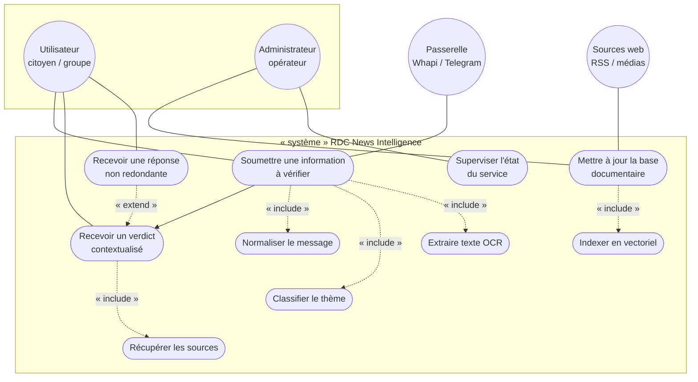
```mermaid
flowchart TB
    subgraph actors_left[" "]
        direction TB
        U((Utilisateur<br/>citoyen / groupe))
        A((Administrateur<br/>opérateur))
    end

    subgraph SYS["« système » RDC News Intelligence"]
        direction TB
        UC1([Soumettre une information<br/>à vérifier])
        UC2([Recevoir un verdict<br/>contextualisé])
        UC3([Recevoir une réponse<br/>non redondante])
        UC4([Mettre à jour la base<br/>documentaire])
        UC5([Superviser l'état<br/>du service])

        UC6([Normaliser le message])
        UC7([Classifier le thème])
        UC8([Récupérer les sources])
        UC9([Indexer en vectoriel])
        UC10([Extraire texte OCR])
    end

    P((Passerelle<br/>Whapi / Telegram))
    W((Sources web<br/>RSS / médias))

    U --- UC1
    P --- UC1
    UC1 --> UC2
    U --- UC2
    U --- UC3

    A --- UC4
    A --- UC5
    W --- UC4

    UC1 -.->|« include »| UC6
    UC1 -.->|« include »| UC7
    UC1 -.->|« include »| UC10
    UC2 -.->|« include »| UC8
    UC3 -.->|« extend »| UC2
    UC4 -.->|« include »| UC9

    UC6 ~~~ UC7
    UC7 ~~~ UC8
```

**Notes pour draw.io :**
- Placer `UC6`, `UC7`, `UC8`, `UC9`, `UC10` à l'intérieur du rectangle système.
- `UC10` n'est invoqué que si le message contient une **image**.
- La passerelle messagerie déclenche `UC1` ; l'utilisateur reçoit `UC2` ou `UC3`.

---

## 2. Diagramme de cas d'utilisation (vue simplifiée)

Version plus lisible pour une page mémoire (5 cas principaux seulement).

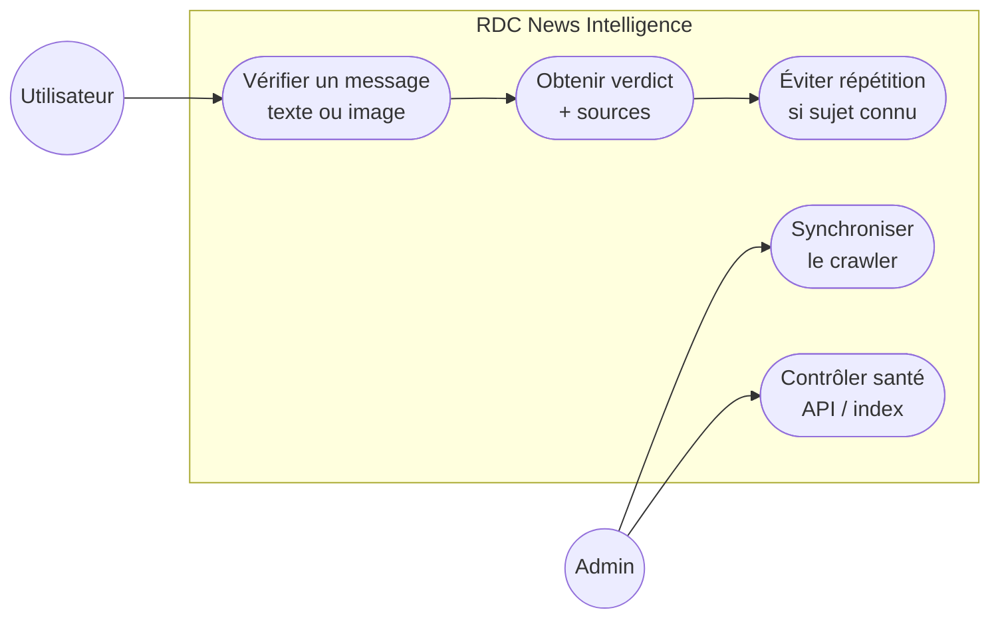
```mermaid
flowchart LR
    U((Utilisateur))
    A((Admin))

    subgraph S["RDC News Intelligence"]
        direction TB
        c1([Vérifier un message<br/>texte ou image])
        c2([Obtenir verdict<br/>+ sources])
        c3([Éviter répétition<br/>si sujet connu])
        c4([Synchroniser<br/>le crawler])
        c5([Contrôler santé<br/>API / index])
    end

    U --> c1
    c1 --> c2
    c2 --> c3
    A --> c4
    A --> c5
```

---

## 3. Diagramme de séquence — Nouveau sujet (pipeline RAG complet)

Correspond au § 3.4.1 du chapitre III et au flux WhatsApp/Telegram en production VPS.

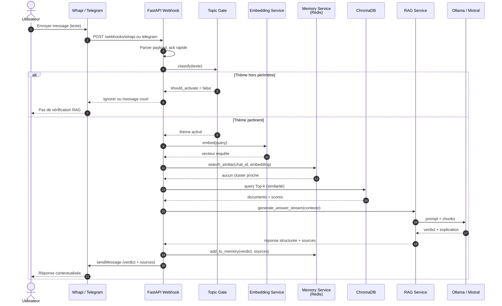
```mermaid
sequenceDiagram
    autonumber
    actor User as Utilisateur
    participant Msg as Whapi / Telegram
    participant API as FastAPI Webhook
    participant TG as Topic Gate
    participant Emb as Embedding Service
    participant Mem as Memory Service<br/>(Redis)
    participant Chroma as ChromaDB
    participant RAG as RAG Service
    participant LLM as Ollama / Mistral

    User->>Msg: Envoyer message (texte)
    Msg->>API: POST /webhooks/whapi ou telegram
    API->>API: Parser payload, ack rapide

    API->>TG: classify(texte)
    alt Thème hors périmètre
        TG-->>API: should_activate = false
        API-->>Msg: Ignorer ou message court
        Msg-->>User: Pas de vérification RAG
    else Thème pertinent
        TG-->>API: thème activé
        API->>Emb: embed(query)
        Emb-->>API: vecteur requête

        API->>Mem: search_similar(chat_id, embedding)
        Mem-->>API: aucun cluster proche

        API->>Chroma: query Top-k (similarité)
        Chroma-->>API: documents + scores

        API->>RAG: generate_answer_stream(contexte)
        RAG->>LLM: prompt + chunks
        LLM-->>RAG: verdict + explication
        RAG-->>API: réponse structurée + sources

        API->>Mem: add_to_memory(verdict, sources)
        API->>Msg: sendMessage (verdict + sources)
        Msg-->>User: Réponse contextualisée
    end
```

---

## 4. Diagramme de séquence — Sujet redondant (anti-surinformation)

Correspond au § 3.4.2 — chemin alternatif lorsque la similarité dépasse le seuil.

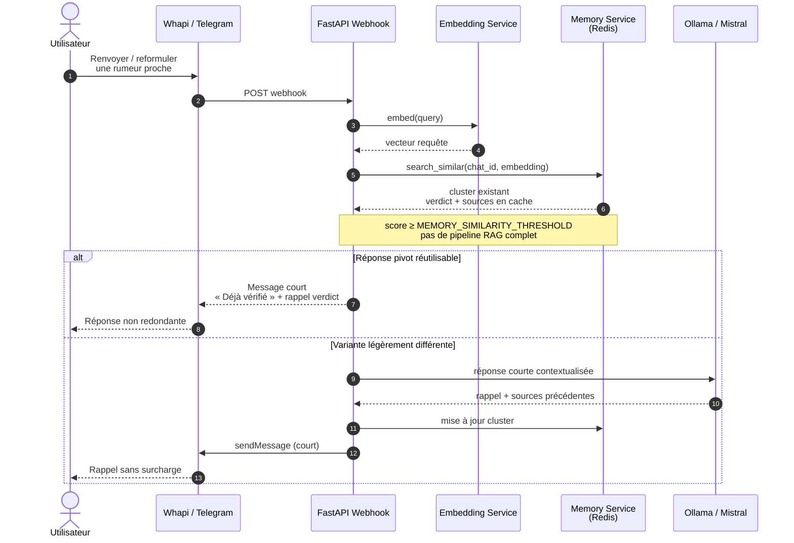
```mermaid
sequenceDiagram
    autonumber
    actor User as Utilisateur
    participant Msg as Whapi / Telegram
    participant API as FastAPI Webhook
    participant Emb as Embedding Service
    participant Mem as Memory Service<br/>(Redis)
    participant LLM as Ollama / Mistral

    User->>Msg: Renvoyer / reformuler<br/>une rumeur proche
    Msg->>API: POST webhook
    API->>Emb: embed(query)
    Emb-->>API: vecteur requête

    API->>Mem: search_similar(chat_id, embedding)
    Mem-->>API: cluster existant<br/>verdict + sources en cache

    Note over API,Mem: score ≥ MEMORY_SIMILARITY_THRESHOLD<br/>pas de pipeline RAG complet

    alt Réponse pivot réutilisable
        API-->>Msg: Message court<br/>« Déjà vérifié » + rappel verdict
        Msg-->>User: Réponse non redondante
    else Variante légèrement différente
        API->>LLM: réponse courte contextualisée
        LLM-->>API: rappel + sources précédentes
        API->>Mem: mise à jour cluster
        API->>Msg: sendMessage (court)
        Msg-->>User: Rappel sans surcharge
    end
```

---

## 5. Diagramme de séquence — Message image (OCR)

Correspond au § 3.4.3.

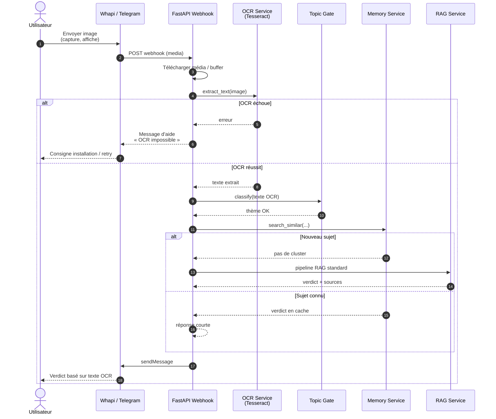
```mermaid
sequenceDiagram
    autonumber
    actor User as Utilisateur
    participant Msg as Whapi / Telegram
    participant API as FastAPI Webhook
    participant OCR as OCR Service<br/>(Tesseract)
    participant TG as Topic Gate
    participant Mem as Memory Service
    participant RAG as RAG Service

    User->>Msg: Envoyer image<br/>(capture, affiche)
    Msg->>API: POST webhook (media)
    API->>API: Télécharger média / buffer

    API->>OCR: extract_text(image)
    alt OCR échoue
        OCR-->>API: erreur
        API-->>Msg: Message d'aide<br/>« OCR impossible »
        Msg-->>User: Consigne installation / retry
    else OCR réussit
        OCR-->>API: texte extrait
        API->>TG: classify(texte OCR)
        TG-->>API: thème OK
        API->>Mem: search_similar(...)
        alt Nouveau sujet
            Mem-->>API: pas de cluster
            API->>RAG: pipeline RAG standard
            RAG-->>API: verdict + sources
        else Sujet connu
            Mem-->>API: verdict en cache
            API-->>API: réponse courte
        end
        API->>Msg: sendMessage
        Msg-->>User: Verdict basé sur texte OCR
    end
```

---

## 6. Diagramme de séquence — Mise à jour documentaire (Crawler)

Correspond au cas d'utilisation « Mettre à jour la base documentaire » (§ 3.3.1).

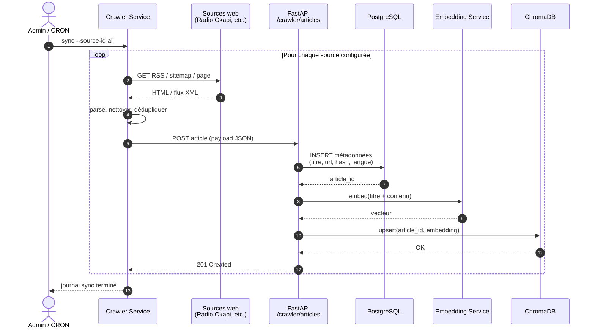
```mermaid
sequenceDiagram
    autonumber
    actor Admin as Admin / CRON
    participant Crawl as Crawler Service
    participant Web as Sources web<br/>(Radio Okapi, etc.)
    participant API as FastAPI<br/>/crawler/articles
    participant PG as PostgreSQL
    participant Emb as Embedding Service
    participant Chroma as ChromaDB

    Admin->>Crawl: sync --source-id all
    loop Pour chaque source configurée
        Crawl->>Web: GET RSS / sitemap / page
        Web-->>Crawl: HTML / flux XML
        Crawl->>Crawl: parse, nettoyer, dédupliquer
        Crawl->>API: POST article (payload JSON)
        API->>PG: INSERT métadonnées<br/>(titre, url, hash, langue)
        PG-->>API: article_id
        API->>Emb: embed(titre + contenu)
        Emb-->>API: vecteur
        API->>Chroma: upsert(article_id, embedding)
        Chroma-->>API: OK
        API-->>Crawl: 201 Created
    end
    Crawl-->>Admin: journal sync terminé
```

---

## 7. Diagramme de séquence — End-to-end (vue globale)

Vue condensée pour une figure de synthèse du chapitre III.

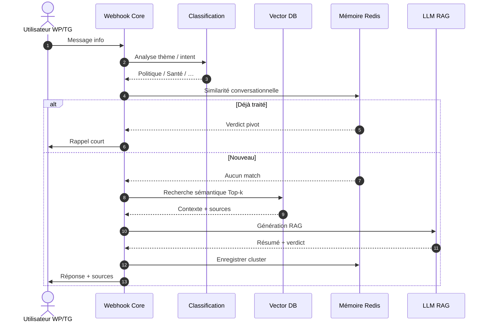
```mermaid
sequenceDiagram
    autonumber
    actor U as Utilisateur WP/TG
    participant W as Webhook Core
    participant C as Classification
    participant V as Vector DB
    participant M as Mémoire Redis
    participant L as LLM RAG

    U->>W: Message info
    W->>C: Analyse thème / intent
    C-->>W: Politique / Santé / …
    W->>M: Similarité conversationnelle
    alt Déjà traité
        M-->>W: Verdict pivot
        W->>U: Rappel court
    else Nouveau
        M-->>W: Aucun match
        W->>V: Recherche sémantique Top-k
        V-->>W: Contexte + sources
        W->>L: Génération RAG
        L-->>W: Résumé + verdict
        W->>M: Enregistrer cluster
        W->>U: Réponse + sources
    end
```

---

## 8. Diagramme de classes (conceptuel + services)

Correspond au § 3.5. Aligné sur les services Python du projet.

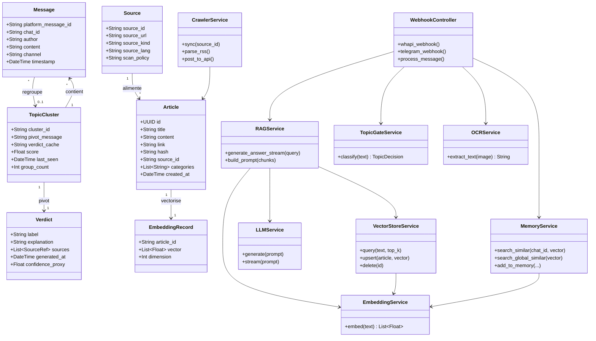
```mermaid
classDiagram
    direction TB

    class Article {
        +UUID id
        +String title
        +String content
        +String link
        +String hash
        +String source_id
        +List~String~ categories
        +DateTime created_at
    }

    class Source {
        +String source_id
        +String source_url
        +String source_kind
        +String source_lang
        +String scan_policy
    }

    class Message {
        +String platform_message_id
        +String chat_id
        +String author
        +String content
        +String channel
        +DateTime timestamp
    }

    class TopicCluster {
        +String cluster_id
        +String pivot_message
        +String verdict_cache
        +Float score
        +DateTime last_seen
        +Int group_count
    }

    class Verdict {
        +String label
        +String explanation
        +List~SourceRef~ sources
        +DateTime generated_at
        +Float confidence_proxy
    }

    class EmbeddingRecord {
        +String article_id
        +List~Float~ vector
        +Int dimension
    }

    class CrawlerService {
        +sync(source_id)
        +parse_rss()
        +post_to_api()
    }

    class VectorStoreService {
        +query(text, top_k)
        +upsert(article, vector)
        +delete(id)
    }

    class EmbeddingService {
        +embed(text) List~Float~
    }

    class RAGService {
        +generate_answer_stream(query)
        +build_prompt(chunks)
    }

    class LLMService {
        +generate(prompt)
        +stream(prompt)
    }

    class MemoryService {
        +search_similar(chat_id, vector)
        +search_global_similar(vector)
        +add_to_memory(...)
    }

    class TopicGateService {
        +classify(text) TopicDecision
    }

    class OCRService {
        +extract_text(image) String
    }

    class WebhookController {
        +whapi_webhook()
        +telegram_webhook()
        +process_message()
    }

    Source "1" --> "*" Article : alimente
    Article "1" --> "1" EmbeddingRecord : vectorise
    Message "*" --> "0..1" TopicCluster : regroupe
    TopicCluster "1" --> "*" Message : contient
    TopicCluster "1" --> "1" Verdict : pivot

    WebhookController --> TopicGateService
    WebhookController --> MemoryService
    WebhookController --> RAGService
    WebhookController --> OCRService
    RAGService --> VectorStoreService
    RAGService --> LLMService
    RAGService --> EmbeddingService
    VectorStoreService --> EmbeddingService
    MemoryService --> EmbeddingService
    CrawlerService --> Article
```

---

## 9. Diagramme de composants (architecture logique)

Correspond au § 3.6.

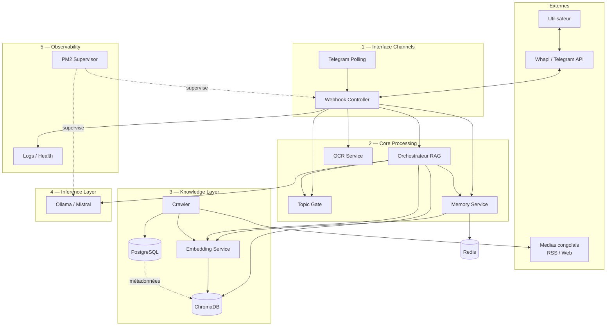
```mermaid
flowchart TB
    subgraph EXT["Externes"]
        U[Utilisateur]
        WH[Whapi / Telegram API]
        MED[Medias congolais<br/>RSS / Web]
    end

    subgraph CH["1 — Interface Channels"]
        WHK[Webhook Controller]
        TGP[Telegram Polling]
    end

    subgraph CORE["2 — Core Processing"]
        TG[Topic Gate]
        MEM[Memory Service]
        ORCH[Orchestrateur RAG]
        OCR[OCR Service]
    end

    subgraph KNOW["3 — Knowledge Layer"]
        CR[Crawler]
        PG[(PostgreSQL)]
        CHR[(ChromaDB)]
        EMB[Embedding Service]
    end

    subgraph INF["4 — Inference Layer"]
        LLM[Ollama / Mistral]
    end

    subgraph OBS["5 — Observability"]
        LOG[Logs / Health]
        PM2[PM2 Supervisor]
    end

    REDIS[(Redis)]

    U <--> WH
    WH <--> WHK
    WHK --> TG
    WHK --> OCR
    WHK --> MEM
    WHK --> ORCH
    TGP --> WHK

    ORCH --> TG
    ORCH --> MEM
    ORCH --> CHR
    ORCH --> LLM

    MEM --> REDIS
    MEM --> EMB
    ORCH --> EMB
    CR --> MED
    CR --> PG
    CR --> EMB
    EMB --> CHR
    PG -. métadonnées .-> CHR

    WHK --> LOG
    PM2 -. supervise .-> WHK
    PM2 -. supervise .-> LLM
```

---

## 10. Diagramme de déploiement (VPS Linux)

Correspond au § 3.7. Déploiement cible décrit au chapitre IV.

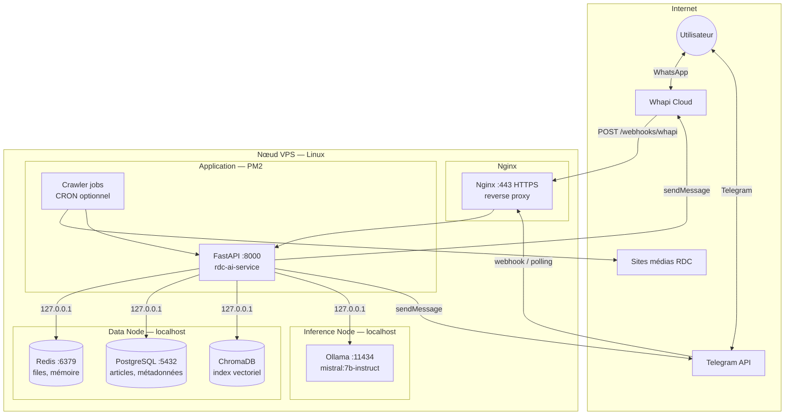
```mermaid
flowchart TB
    subgraph INTERNET["Internet"]
        USER((Utilisateur))
        WHAPI[Whapi Cloud]
        TGAPI[Telegram API]
        SRC[Sites médias RDC]
    end

    subgraph VPS["Nœud VPS — Linux"]
        subgraph PROXY["Nginx"]
            NGINX[Nginx :443 HTTPS<br/>reverse proxy]
        end

        subgraph APP["Application — PM2"]
            API[FastAPI :8000<br/>rdc-ai-service]
            CRON[Crawler jobs<br/>CRON optionnel]
        end

        subgraph DATA["Data Node — localhost"]
            PG[(PostgreSQL :5432<br/>articles, métadonnées)]
            REDIS[(Redis :6379<br/>files, mémoire)]
            CHROMA[(ChromaDB<br/>index vectoriel)]
        end

        subgraph INFER["Inference Node — localhost"]
            OLL[Ollama :11434<br/>mistral:7b-instruct]
        end
    end

    USER <-->|WhatsApp| WHAPI
    USER <-->|Telegram| TGAPI

    WHAPI -->|POST /webhooks/whapi| NGINX
    TGAPI -->|webhook / polling| NGINX
    NGINX --> API

    API -->|127.0.0.1| REDIS
    API -->|127.0.0.1| PG
    API -->|127.0.0.1| CHROMA
    API -->|127.0.0.1| OLL

    CRON --> SRC
    CRON --> API

    API -->|sendMessage| WHAPI
    API -->|sendMessage| TGAPI
```

---

## 11. Diagramme de déploiement (notation C4 simplifiée)

Alternative plus compacte pour draw.io.

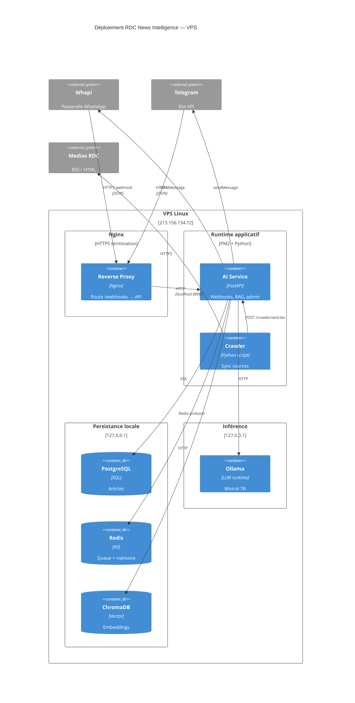
```mermaid
C4Deployment
    title Déploiement RDC News Intelligence — VPS

    Deployment_Node(vps, "VPS Linux", "213.156.134.72") {
        Deployment_Node(nginx, "Nginx", "HTTPS termination") {
            Container(proxy, "Reverse Proxy", "Nginx", "Route /webhooks → API")
        }
        Deployment_Node(app, "Runtime applicatif", "PM2 + Python") {
            Container(fastapi, "AI Service", "FastAPI", "Webhooks, RAG, admin")
            Container(crawler, "Crawler", "Python script", "Sync sources")
        }
        Deployment_Node(data, "Persistance locale", "127.0.0.1") {
            ContainerDb(postgres, "PostgreSQL", "SQL", "Articles")
            ContainerDb(redis, "Redis", "KV", "Queue + mémoire")
            ContainerDb(chroma, "ChromaDB", "Vector", "Embeddings")
        }
        Deployment_Node(llm, "Inférence", "127.0.0.1") {
            Container(ollama, "Ollama", "LLM runtime", "Mistral 7B")
        }
    }

    System_Ext(whapi, "Whapi", "Passerelle WhatsApp")
    System_Ext(telegram, "Telegram", "Bot API")
    System_Ext(media, "Medias RDC", "RSS / HTML")

    Rel(whapi, proxy, "HTTPS webhook", "JSON")
    Rel(telegram, proxy, "HTTPS", "JSON")
    Rel(proxy, fastapi, "HTTP", "localhost:8000")
    Rel(fastapi, postgres, "SQL")
    Rel(fastapi, redis, "Redis protocol")
    Rel(fastapi, chroma, "HTTP")
    Rel(fastapi, ollama, "HTTP")
    Rel(crawler, media, "HTTPS")
    Rel(crawler, fastapi, "POST /crawler/articles")
    Rel(fastapi, whapi, "sendMessage")
    Rel(fastapi, telegram, "sendMessage")
```

> **Note :** le diagramme C4 nécessite Mermaid ≥ 9.3. Si le rendu échoue, utiliser le diagramme § 10 (flowchart).

---

## 12. Diagramme d'activité — Traitement d'un message entrant

Utile en complément du chapitre III (flux décisionnel).

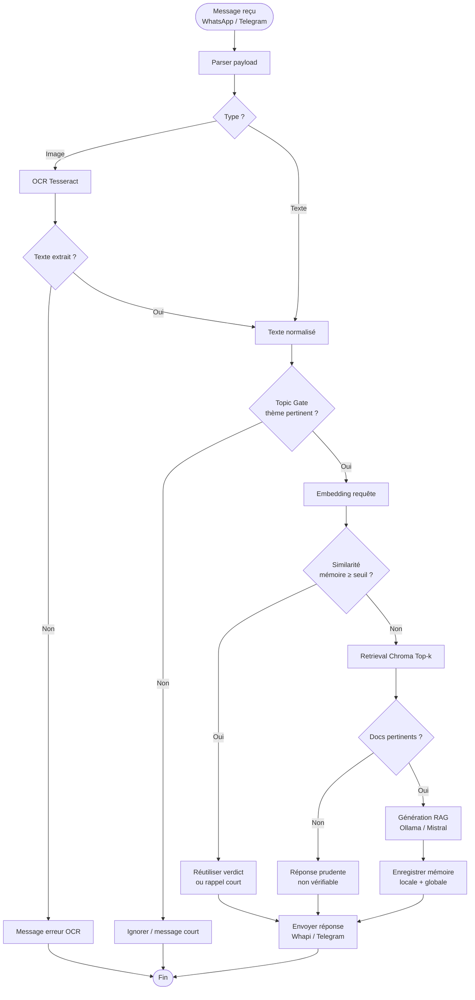
```mermaid
flowchart TD
    START([Message reçu<br/>WhatsApp / Telegram]) --> PARSE[Parser payload]
    PARSE --> TYPE{Type ?}

    TYPE -->|Image| OCR[OCR Tesseract]
    OCR --> OCR_OK{Texte extrait ?}
    OCR_OK -->|Non| ERR[Message erreur OCR]
    OCR_OK -->|Oui| TEXT
    TYPE -->|Texte| TEXT[Texte normalisé]

    TEXT --> GATE{Topic Gate<br/>thème pertinent ?}
    GATE -->|Non| IGNORE[Ignorer / message court]
    GATE -->|Oui| EMB[Embedding requête]

    EMB --> SIM{Similarité<br/>mémoire ≥ seuil ?}
    SIM -->|Oui| REUSE[Réutiliser verdict<br/>ou rappel court]
    SIM -->|Non| RETRIEVE[Retrieval Chroma Top-k]

    RETRIEVE --> RAG_OK{Docs pertinents ?}
    RAG_OK -->|Non| PRUDENT[Réponse prudente<br/>non vérifiable]
    RAG_OK -->|Oui| GEN[Génération RAG<br/>Ollama / Mistral]

    GEN --> SAVE[Enregistrer mémoire<br/>locale + globale]
    REUSE --> SEND
    SAVE --> SEND[Envoyer réponse<br/>Whapi / Telegram]
    PRUDENT --> SEND
    IGNORE --> END([Fin])
    ERR --> END
    SEND --> END
```

---

## 13. Schéma relationnel PostgreSQL (ERD)

**Source de vérité** pour les métadonnées des articles. Les vecteurs ne sont **pas** stockés dans PostgreSQL (recherche déléguée à ChromaDB).

Fichier : `ai-service/app/db/models.py`

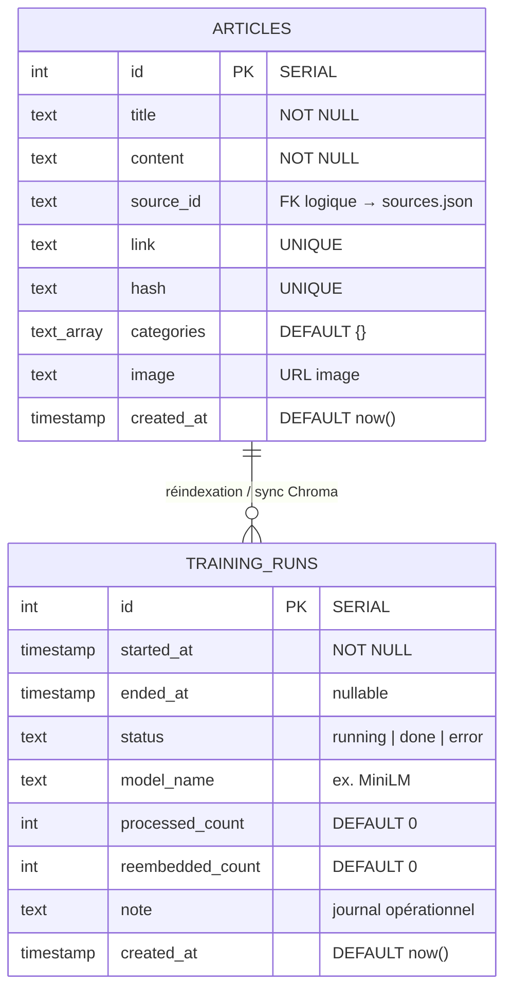
```mermaid
erDiagram
    ARTICLES {
        int id PK "SERIAL"
        text title "NOT NULL"
        text content "NOT NULL"
        text source_id "FK logique → sources.json"
        text link "UNIQUE"
        text hash "UNIQUE"
        text_array categories "DEFAULT {}"
        text image "URL image"
        timestamp created_at "DEFAULT now()"
    }

    TRAINING_RUNS {
        int id PK "SERIAL"
        timestamp started_at "NOT NULL"
        timestamp ended_at "nullable"
        text status "running | done | error"
        text model_name "ex. MiniLM"
        int processed_count "DEFAULT 0"
        int reembedded_count "DEFAULT 0"
        text note "journal opérationnel"
        timestamp created_at "DEFAULT now()"
    }

    ARTICLES ||--o{ TRAINING_RUNS : "réindexation / sync Chroma"
```

**Index et contraintes (draw.io — annoter sur les tables) :**

| Table | Contrainte / index |
|-------|-------------------|
| `articles` | `PRIMARY KEY (id)` |
| `articles` | `UNIQUE (link)` WHERE link IS NOT NULL |
| `articles` | `UNIQUE (hash)` WHERE hash IS NOT NULL |
| `training_runs` | `INDEX (started_at)`, `INDEX (status)` |

**Relation logique `articles.source_id` :** pas de table SQL `sources` ; le catalogue est dans `data/crawler/sources.json` (voir § 16).

---

## 14. ERD PostgreSQL — notation tables (draw.io)

Version « boîtes » pour recopier facilement dans draw.io (une entité = un rectangle).

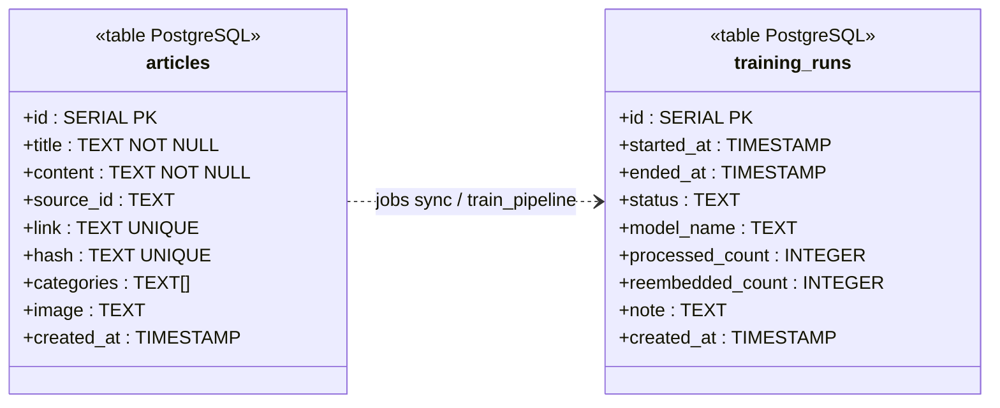
```mermaid
classDiagram
    direction LR

    class articles {
        <<table PostgreSQL>>
        +id : SERIAL PK
        +title : TEXT NOT NULL
        +content : TEXT NOT NULL
        +source_id : TEXT
        +link : TEXT UNIQUE
        +hash : TEXT UNIQUE
        +categories : TEXT[]
        +image : TEXT
        +created_at : TIMESTAMP
    }

    class training_runs {
        <<table PostgreSQL>>
        +id : SERIAL PK
        +started_at : TIMESTAMP
        +ended_at : TIMESTAMP
        +status : TEXT
        +model_name : TEXT
        +processed_count : INTEGER
        +reembedded_count : INTEGER
        +note : TEXT
        +created_at : TIMESTAMP
    }

    articles ..> training_runs : jobs sync / train_pipeline
```

---

## 15. ChromaDB — collection `articles_rdc`

**Moteur sémantique** : embeddings 384D, métrique cosine, index HNSW.  
Fichier : `ai-service/app/services/vector_store_service.py`  
Chemin disque : `ai-service/data/chroma_db/`

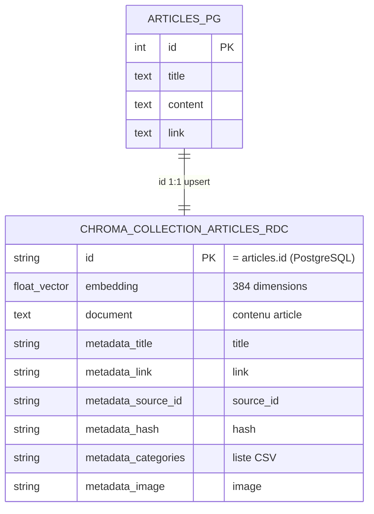
```mermaid
erDiagram
    CHROMA_COLLECTION_ARTICLES_RDC {
        string id PK " = articles.id (PostgreSQL)"
        float_vector embedding "384 dimensions"
        text document "contenu article"
        string metadata_title "title"
        string metadata_link "link"
        string metadata_source_id "source_id"
        string metadata_hash "hash"
        string metadata_categories "liste CSV"
        string metadata_image "image"
    }

    ARTICLES_PG {
        int id PK
        text title
        text content
        text link
    }

    ARTICLES_PG ||--|| CHROMA_COLLECTION_ARTICLES_RDC : "id 1:1 upsert"
```

**Opérations :**

| Opération | Méthode | Usage |
|-----------|---------|--------|
| Insert / update | `collection.upsert()` | Après ingestion crawler ou `sync_to_chroma.py` |
| Recherche RAG | `collection.query()` Top-k | `similarity = 1 - distance` |
| Seuils | env | `RAG_MIN_SIMILARITY`, `RAG_MIN_SIMILARITY_MSG` |

---

## 16. Catalogue sources (fichier — hors SQL)

Le crawler lit un **fichier JSON**, pas une table relationnelle.

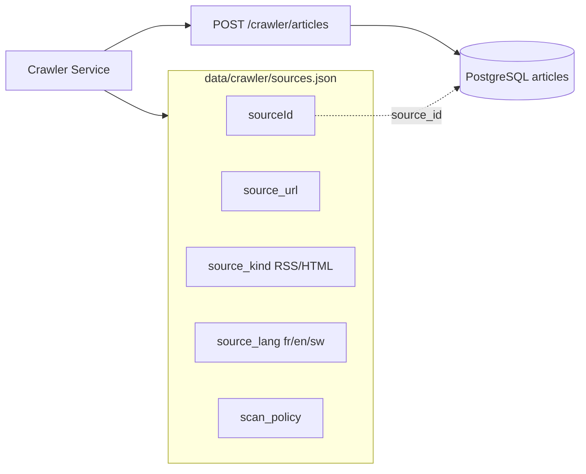
```mermaid
flowchart LR
    subgraph FILE["data/crawler/sources.json"]
        S1[sourceId]
        S2[source_url]
        S3[source_kind RSS/HTML]
        S4[source_lang fr/en/sw]
        S5[scan_policy]
    end

    CR[Crawler Service] --> FILE
    CR --> API["POST /crawler/articles"]
    API --> PG[(PostgreSQL articles)]

    S1 -.->|source_id| PG
```

**Pour draw.io :** représenter `sources.json` comme entité **externe** (document) liée à `articles.source_id` par une association logique `0..*` (pas de FK SQL).

---

## 17. Redis — mémoire conversationnelle (anti-redondance)

Données **éphémères** (TTL par défaut 3600 s). Pas de schéma SQL.

Fichier : `ai-service/app/services/memory_service.py`

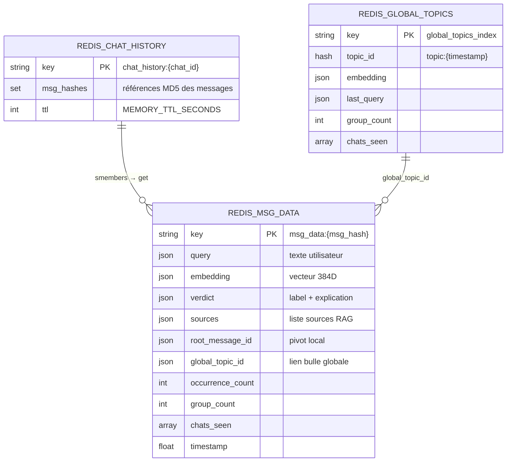
```mermaid
erDiagram
    REDIS_CHAT_HISTORY {
        string key PK "chat_history:{chat_id}"
        set msg_hashes "références MD5 des messages"
        int ttl "MEMORY_TTL_SECONDS"
    }

    REDIS_MSG_DATA {
        string key PK "msg_data:{msg_hash}"
        json query "texte utilisateur"
        json embedding "vecteur 384D"
        json verdict "label + explication"
        json sources "liste sources RAG"
        json root_message_id "pivot local"
        json global_topic_id "lien bulle globale"
        int occurrence_count
        int group_count
        array chats_seen
        float timestamp
    }

    REDIS_GLOBAL_TOPICS {
        string key PK "global_topics_index"
        hash topic_id "topic:{timestamp}"
        json embedding
        json last_query
        int group_count
        array chats_seen
    }

    REDIS_CHAT_HISTORY ||--o{ REDIS_MSG_DATA : "smembers → get"
    REDIS_GLOBAL_TOPICS ||--o{ REDIS_MSG_DATA : "global_topic_id"
```

**Clés Redis à dessiner dans draw.io :**

| Clé | Type | Contenu |
|-----|------|---------|
| `chat_history:{chat_id}` | SET | Hashes des messages du groupe |
| `msg_data:{md5(query)}` | STRING (JSON) | Verdict, embedding, sources, pivot |
| `global_topics_index` | HASH | Sujets transverses (multi-groupes) |

---

## 18. Architecture globale des données (mémoire duale)

Vue d'ensemble pour le mémoire — équivalent du schéma `architecture-bases-donnees-rdc-news.png`.

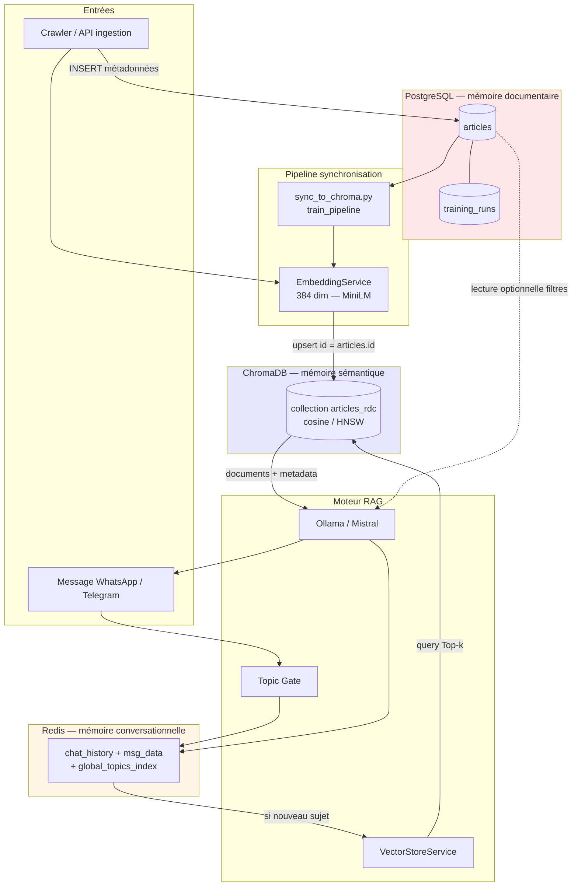
```mermaid
flowchart TB
    subgraph IN["Entrées"]
        CRAWL[Crawler / API ingestion]
        USER[Message WhatsApp / Telegram]
    end

    subgraph PG["PostgreSQL — mémoire documentaire"]
        T_ART[(articles)]
        T_RUN[(training_runs)]
        T_ART --- T_RUN
    end

    subgraph SYNC["Pipeline synchronisation"]
        EMB[EmbeddingService<br/>384 dim — MiniLM]
        SYNC_SCRIPT[sync_to_chroma.py<br/>train_pipeline]
    end

    subgraph CHROMA["ChromaDB — mémoire sémantique"]
        COLL[(collection articles_rdc<br/>cosine / HNSW)]
    end

    subgraph REDIS["Redis — mémoire conversationnelle"]
        MEM[chat_history + msg_data<br/>+ global_topics_index]
    end

    subgraph RAG["Moteur RAG"]
        GATE[Topic Gate]
        VS[VectorStoreService]
        LLM[Ollama / Mistral]
    end

    CRAWL -->|INSERT métadonnées| T_ART
    CRAWL --> EMB
    T_ART --> SYNC_SCRIPT
    SYNC_SCRIPT --> EMB
    EMB -->|upsert id = articles.id| COLL

    USER --> GATE
    GATE --> MEM
    MEM -->|si nouveau sujet| VS
    VS -->|query Top-k| COLL
    COLL -->|documents + metadata| LLM
    T_ART -.->|lecture optionnelle filtres| LLM
    LLM --> MEM
    LLM --> USER

    style PG fill:#ffe6e6
    style CHROMA fill:#e6e6ff
    style REDIS fill:#fff4e6
```

**Légende couleurs (suggestion draw.io) :**

| Couleur | Couche |
|---------|--------|
| Rouge clair | PostgreSQL — vérité relationnelle |
| Bleu clair | ChromaDB — recherche vectorielle |
| Orange clair | Redis — état court terme / anti-répétition |

---

## 19. Flux de données — ingestion article (séquence données)

Complément au diagramme de séquence crawler (§ 6).

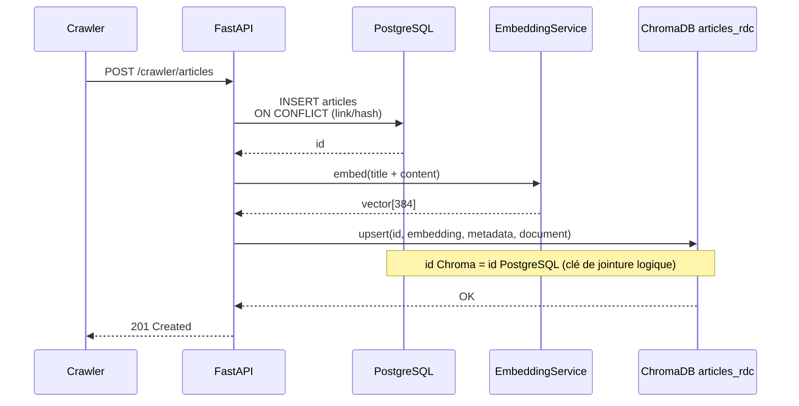
```mermaid
sequenceDiagram
    participant Crawl as Crawler
    participant API as FastAPI
    participant PG as PostgreSQL
    participant Emb as EmbeddingService
    participant Chroma as ChromaDB articles_rdc

    Crawl->>API: POST /crawler/articles
    API->>PG: INSERT articles<br/>ON CONFLICT (link/hash)
    PG-->>API: id

    API->>Emb: embed(title + content)
    Emb-->>API: vector[384]

    API->>Chroma: upsert(id, embedding, metadata, document)
    Note over PG,Chroma: id Chroma = id PostgreSQL (clé de jointure logique)

    Chroma-->>API: OK
    API-->>Crawl: 201 Created
```

---

## 20. Correspondance chapitre III ↔ figures draw.io

| Section chapitre III | Fichier Mermaid (section) | Fichier draw.io existant (ai-service/docs) |
|----------------------|---------------------------|--------------------------------------------|
| § 3.3 Cas d'utilisation | § 1 ou § 2 | `01-use-cases.drawio` |
| § 3.4.1 Séquence RAG | § 3 | `03-rag-sequence.drawio` |
| § 3.4.2 Anti-redondance | § 4 | `06-anti-infobesity-architecture.drawio` |
| § 3.4.3 OCR | § 5 | `Diagramme_Sequence_Interception.drawio` |
| § 3.4 Crawler | § 6 | `Diagramme_Sequence_Crawler.drawio` |
| § 3.4 Vue globale | § 7 | `Diagramme_Sequence_Generale.drawio` |
| § 3.5 Classes | § 8 | `04-class-diagram.drawio` |
| § 3.6 Composants | § 9 | `architecture.drawio` |
| § 3.7 Déploiement | § 10 ou § 11 | `02-deployment-sequence.drawio` |
| Flux décisionnel | § 12 | — |
| **Base de données PostgreSQL (ERD)** | **§ 13–14** | `05-erd.drawio` |
| **ChromaDB collection** | **§ 15** | — |
| **Catalogue sources JSON** | **§ 16** | — |
| **Redis mémoire** | **§ 17** | — |
| **Architecture données globale** | **§ 18** | `architecture-bases-donnees-rdc-news.png` |
| **Flux ingestion article** | **§ 19** | — |

> **Note :** l'ancien `05-erd.drawio` mentionne une colonne `embedding VECTOR(384)` dans `articles`. En architecture actuelle, les vecteurs sont **uniquement dans ChromaDB** ; ne pas redessiner cette colonne dans PostgreSQL.

---

## 21. Conseils draw.io

1. **Cas d'utilisation** : menu *Arrange → Insert → Advanced → UML* ou bibliothèque « UML ».
2. **Séquence** : forme « Lifeline » + messages avec flèches pleines (appel) et pointillées (retour).
3. **Classes** : compartiments Nom / attributs / méthodes ; relations avec multiplicités `1`, `*`, `0..1`.
4. **Déploiement** : cubes 3D ou rectangles « node » ; flèches annotées `127.0.0.1:port`.
5. Exporter en **PNG** haute résolution pour insertion Word/LaTeX du mémoire.
6. **ERD** : forme « Entity » ou rectangle à compartiments ; clés PK soulignées, UNIQUE noté `(UQ)`.
7. **PostgreSQL + Chroma** : deux cylindres reliés par une flèche « sync / upsert » (§ 18).
8. **Redis** : cylindre ou nuage séparé, TTL indiqué sur les clés éphémères.
